# 🛸 Space Race Theme: Flight Operations Desktop Environment

<div align="center">

[](LICENSE)
[](https://archlinux.org)
[](https://hyprland.org)
[](https://wayland.freedesktop.org)
[](https://github.com/diogogc/Space-Race-Theme)

**An authentic, retro-futuristic Linux Wayland desktop environment inspired by the historic 1960s Space Race.**  
*Engineered for Hyprland, Waybar, Ghostty, Kitty, Dunst, Hyprlock, and custom GTK3/Cairo flight telemetry dialogs.*

<br/>

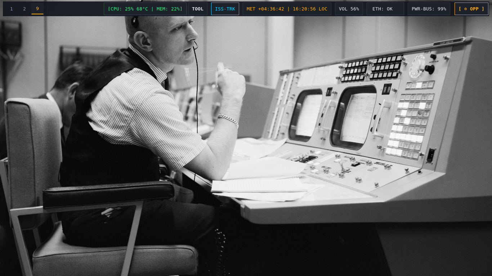

</div>

---

## 🌌 Flight Deck Mission Profiles

The environment features four authentic vintage flight-deck profiles switchable in real-time (`SUPER + SHIFT + T` or DSKY key `[V]`):

| Profile | Era & Inspiration | Primary Palette | Key Characteristics |
| :--- | :--- | :--- | :--- |
| **🚀 NASA** | Apollo Houston MOCR (1969) | Amber Gold (`#ffb000`), Obsidian Chassis (`#0a0d12`) | Segmented mission elapsed time, annunciator alerts, Quindar telemetry tones, Saturn V ASCII. |
| **💾 CRT-Amber** | IBM System/360 Model 91 (1964) | Phosphor Amber (`#ff9e00`), Deep Carbon (`#060709`) | Zero-radius industrial mainframe terminal styling, vintage hardware aesthetics & magnetic reel ASCII. |
| **📟 CRT-Green** | DEC VT100 / MIT AGC DSKY (1966) | Phosphor Green (`#33ff33`), Deep Forest (`#040704`) | MIT Instrumentation Lab guidance computer aesthetic with Verb/Noun annunciators & rope memory telemetry. |
| **🛰️ Kosmos-VFD** | Soviet Space Program / OKB-1 (1961) | Mint Phosphor (`#00f0d0`), Cosmic Crimson (`#dc1e1e`) | VFD vacuum fluorescent display styling, Cyrillic status telemetry (*ПОЕХАЛИ!*), Vostok-1 orbital matrix. |

---

## 📸 Flight Deck Showcase & Mission Instruments

<div align="center">

### 🎛️ Apollo AGC DSKY Application Launcher
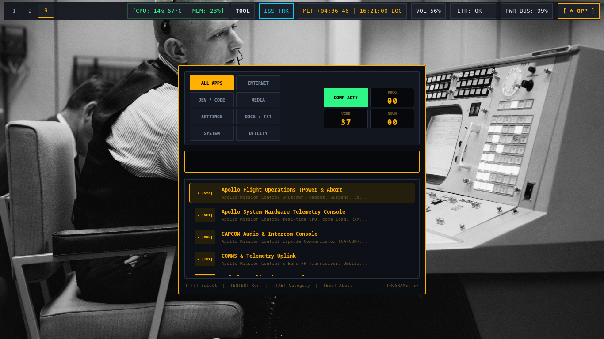
<p><i>AGC Colossus 2A Verb/Noun interface with 8 mission filter groups and live theme switching.</i></p>

<br/>

### 🖳 Dynamic Terminal Fastfetch & Retro Phosphor Cursors
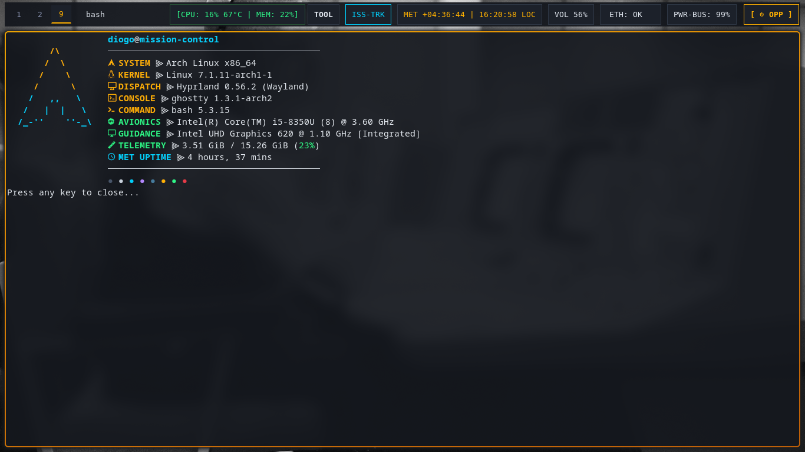
<p><i>Theme-specific Fastfetch ASCII telemetry paired with pixel-precise phosphor radar cursors.</i></p>

<br/>

### 🛰️ Multi-Monitor Display Radar & Topology Console
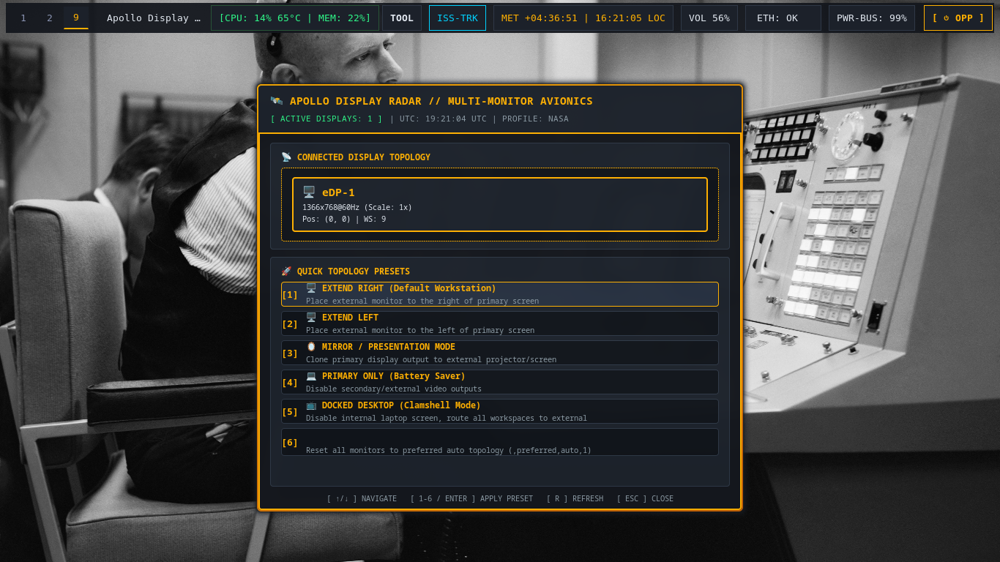
<p><i>Live Wayland output radar with 1-click display topology presets (Extend, Mirror, Solo, Dock).</i></p>

<br/>

### 🎨 Visual Avionics & Theme Configurator
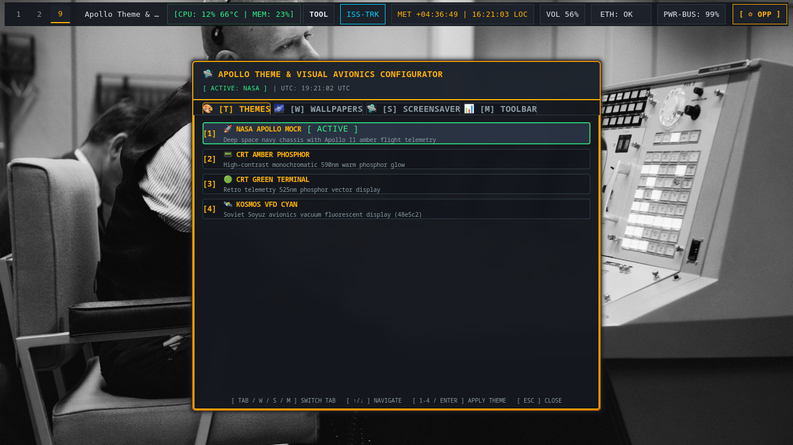
<p><i>Interactive flight controls for live palette previewing, in-theme wallpaper cycling, and screensaver timers.</i></p>

<br/>

### 📡 System Hardware Telemetry & Communications Radar
<p align="center">
  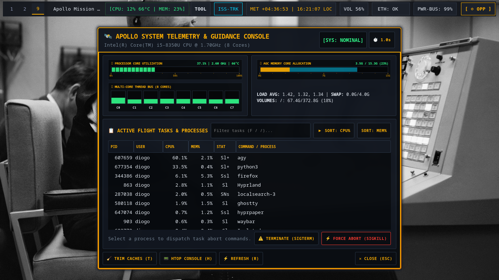
  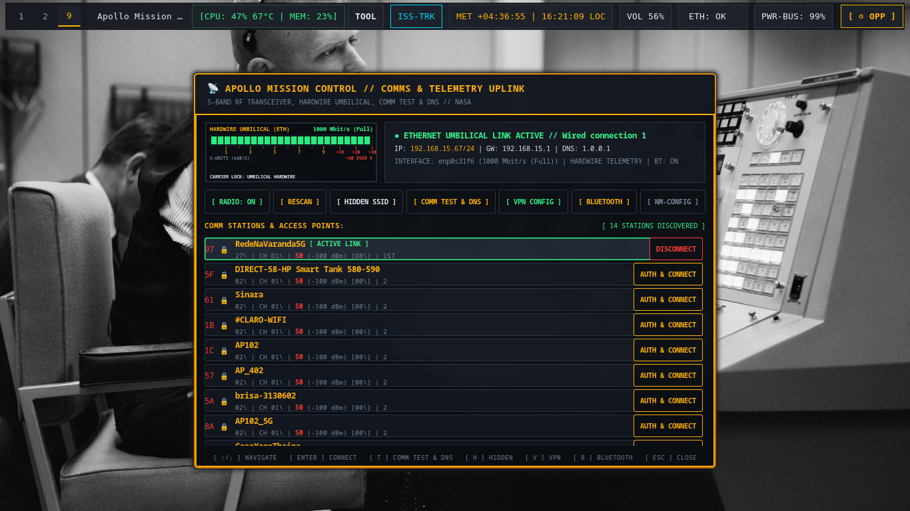
</p>

<br/>

### 🛰️ ISS Real-Time Orbital Tracker & Mission Tools Studio
<p align="center">
  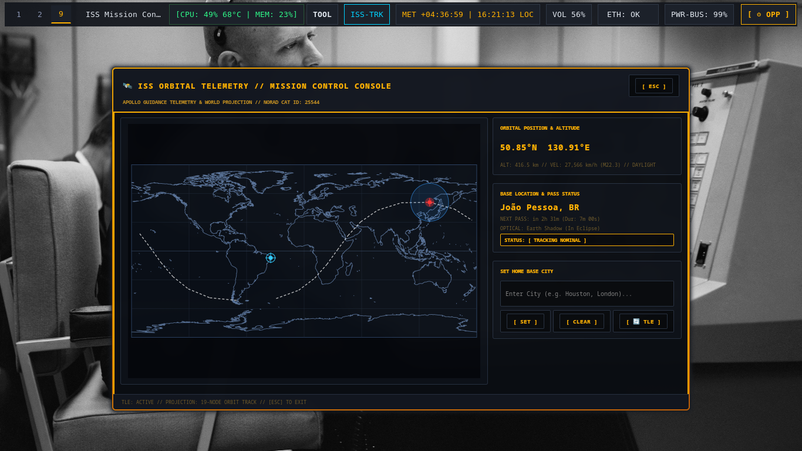
  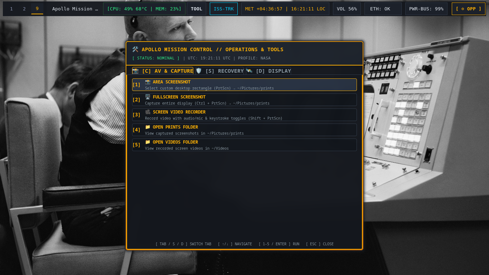
</p>

<br/>

### 🚨 Emergency Flight Abort & Keybinding Flight Directory
<p align="center">
  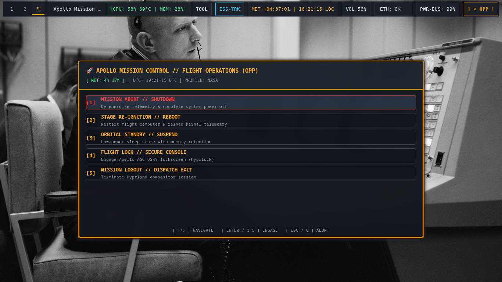
  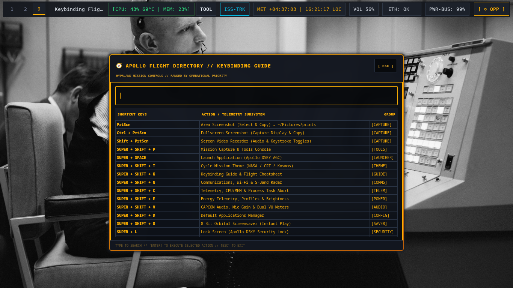
</p>

</div>

---

## ✨ Core Engineering & Architecture

1. **Horizontal Slide Workspace Transitions**: Smooth `slide` kinematics tuned with `easeOutQuint` deceleration curves (`speed = 3.5`) across all 10 mission workspaces.
2. **Dynamic Fastfetch ASCII Telemetry**: Profile-driven terminal telemetry with Saturn V, IBM 360, MIT AGC DSKY, and Vostok-1 ASCII logos.
3. **Discrete 44.1 kHz PCM Sound Engine (`space-quindar`)**:
   - Mechanical camera shutter & 3.2 kHz confirmation ping on screenshot capture.
   - Mainframe solenoid relay click when cycling mission themes.
   - Authentic Apollo `1202 PROGRAM ALARM` tone on critical fuel/battery (<15%).
   - Frequency sweeps for session lock/unlock events.
4. **Retro Phosphor Wayland Cursors**: Standalone cursor suites (`Space-Retro-Amber`, `Space-Retro-Green`, `Space-Retro-Mint`) synchronized dynamically with active color tokens.
5. **8-Bit Retro Space Screensaver (`space-screensaver`)**:
   - Nearest-neighbor $480 \times 270$ retro pixel scaling.
   - 5 historical narrative flight scenes: *Arch Linux Recon*, *NASA Meatball*, *Apollo 11 Moon Landing*, *Interkosmos*, and *Vostok 1 Yuri Gagarin Mission*.
6. **Strict Zero-White-Background Policy**: Eliminates blinding flashes across all dialogs, popups, menus, and tools.

---

## ⌨️ Flight Operations Keybinding Cheatsheet

| Keybinding | Command / Action | Description |
| :--- | :--- | :--- |
| `SUPER + Space` / `SUPER + R` | `dsky-launcher` | Apollo DSKY Mission Application Launcher |
| `ALT + TAB` / `SUPER + TAB` | `space-switcher` | Apollo HUD Mission Window Switcher |
| `SUPER + SHIFT + T` | `space-theme-switch next` | Cycle Mission Profile (NASA / CRT-Amber / CRT-Green / Kosmos-VFD) |
| `SUPER + ALT + T` | `space-theme-config` | Visual Avionics & Theme Configurator Modal |
| `SUPER + ALT + W` | `space-wallpaper next` | Cycle In-Theme Historical Wallpaper |
| `SUPER + SHIFT + R` | `space-display` | Display Radar & Multi-Monitor Console |
| `SUPER + SHIFT + P` | `space-tools-dialog` | Mission Tools, Capture & Video Recording Studio |
| `SUPER + SHIFT + C` | `space-telemetry-dialog` | System Hardware Telemetry & Task Abort Console |
| `SUPER + SHIFT + N` | `space-network-dialog` | Communications & Wi-Fi Radar Console |
| `SUPER + SHIFT + E` | `space-energy-dialog` | MDC-02 Power Telemetry & Energy Profiles |
| `SUPER + SHIFT + V` | `space-capcom-dialog` | CAPCOM Audio Intercom & Dual VU Meters |
| `SUPER + SHIFT + K` | `space-keybinds` | Keybinding Flight Guide & Cheatsheet Modal |
| `SUPER + SHIFT + O` | `space-screensaver` | 8-Bit Retro Multi-Scene Screensaver (Instant Play) |
| `SUPER + SHIFT + M` / `ESC` | `space-power-menu` | Emergency Flight Abort / Power Menu |
| `SUPER + L` | `hyprlock` | DSKY PASSCODE Secure Lockscreen |
| `SUPER + T` | `$terminal` | Launch Mission Terminal (Ghostty / Kitty) |
| `SUPER + E` | `$fileManager` | Open Mission File Explorer |
| `SUPER + F` | `fullscreen` | Toggle Fullscreen Window Mode |
| `SUPER + V` | `togglefloating` | Toggle Floating Window Mode |
| `SUPER + Q` | `killactive` | Close / Terminate Active Flight Window |
| `SUPER + [1 - 9]` | `workspace [1-9]` | Direct Horizontal Slide Workspace Jump |
| `Print` / `Ctrl+Print` | `space-capture` | Instant Area / Fullscreen Capture (Auto-Copy + Shutter Audio) |

---

## 🚀 Installation & Setup

### Prerequisites (Arch Linux)
```bash
sudo pacman -S hyprland waybar ghostty kitty dunst hyprlock hyprpaper fastfetch \
               python-gobject python-cairo gtk3 wayland-protocols base-devel \
               brightnessctl wireplumber playerctl
```

### Installation Options

#### 1. Live Workspace Symlink (Recommended for Developers)
```bash
git clone https://github.com/diogogc/Space-Race-Theme.git ~/Space-Race-Theme
cd ~/Space-Race-Theme
./install.sh --link
```

#### 2. Full Static Install
```bash
git clone https://github.com/diogogc/Space-Race-Theme.git
cd Space-Race-Theme
./install.sh
```

### Uninstallation
```bash
./uninstall.sh         # Interactive removal
./uninstall.sh --clean # Clean binaries, configs, and purge runtime caches
```

---

## 📄 License

Released under the [MIT License](LICENSE). Built for the space exploration & retro-computing community.
