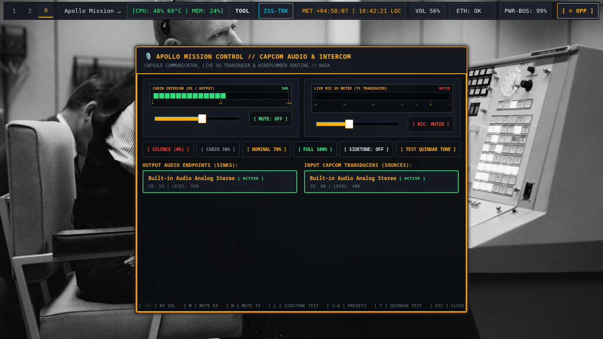
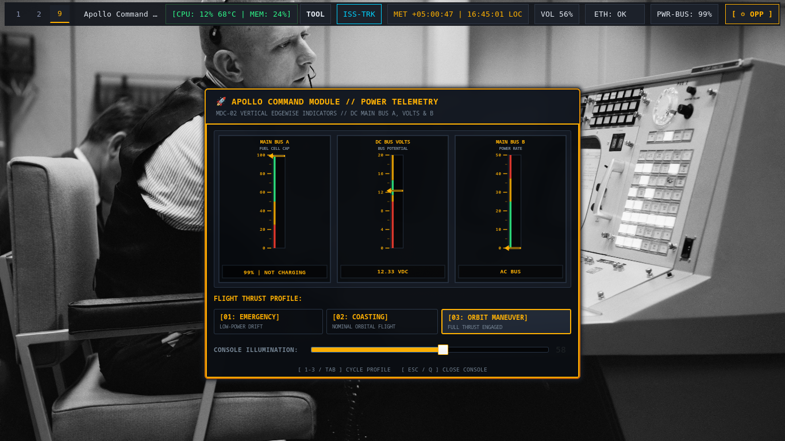
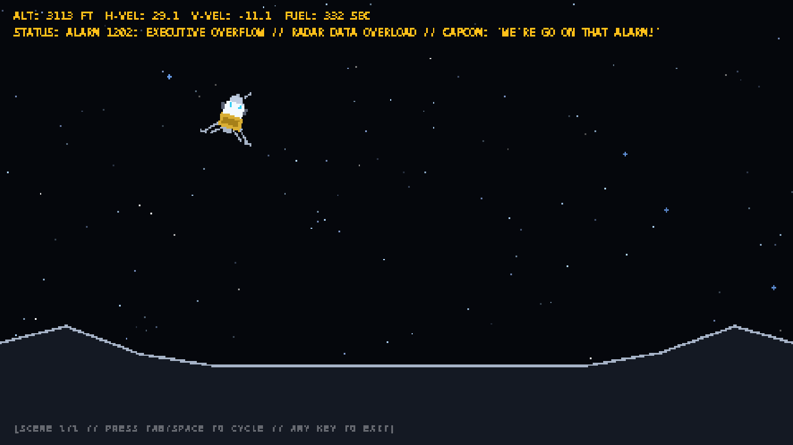
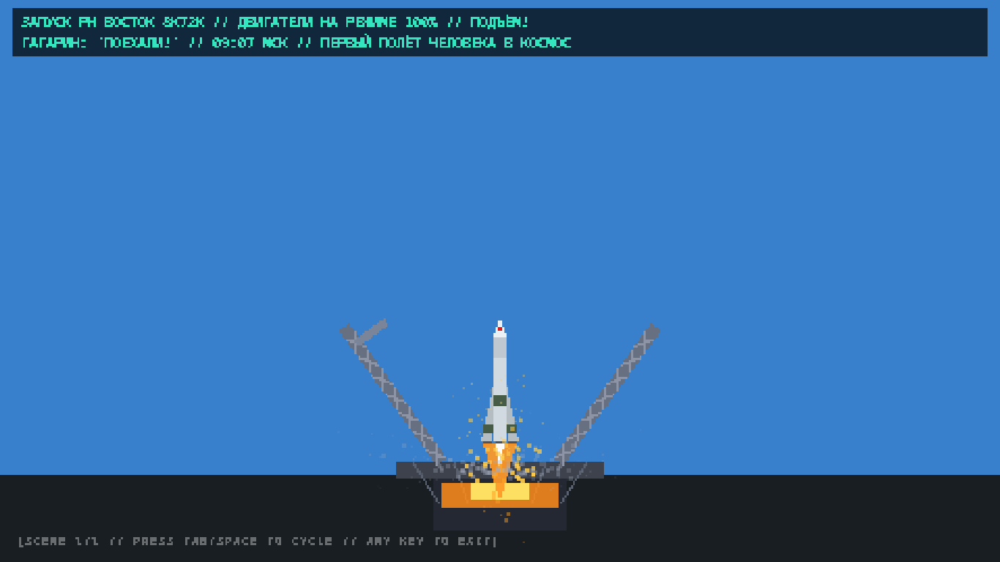

# 🛸 Space Race Theme: Flight Operations Desktop Environment

<div align="center">

[](LICENSE)
[](https://archlinux.org)
[](https://hyprland.org)
[](https://wayland.freedesktop.org)
[](wiki/README.md)

**An authentic, retro-futuristic Linux Wayland desktop environment inspired by the historic 1960s Space Race.**  
*Engineered for Hyprland, Waybar, Ghostty, Kitty, Dunst, Hyprlock, and custom GTK3/Cairo flight telemetry dialogs.*

<br/>

📖 **[Read the Full Documentation & Flight Manual in the Theme Wiki ➔](wiki/README.md)**

<br/>


</div>

---

## 🌌 Flight Deck Mission Profiles

The environment features four authentic vintage flight-deck profiles switchable in real-time (`SUPER + SHIFT + T` or DSKY key `[V]`):

| Profile | Era & Inspiration | Primary Palette | Key Characteristics |
| :--- | :--- | :--- | :--- |
| **🚀 NASA** | Apollo Houston MOCR (1969) | Amber Gold (`#ffb000`), Obsidian Chassis (`#0a0d12`) | Segmented mission elapsed time, annunciator alerts, Quindar telemetry tones, Saturn V ASCII. |
| **💾 CRT-Amber** | IBM System/360 Model 91 (1964) | Phosphor Amber (`#ff9e00`), Deep Carbon (`#060709`) | Zero-radius industrial mainframe terminal styling, vintage hardware aesthetics & magnetic reel ASCII. |
| **📟 CRT-Green** | DEC VT100 / MIT AGC DSKY (1966) | Phosphor Green (`#33ff33`), Deep Forest (`#040704`) | MIT Instrumentation Lab guidance computer aesthetic with Verb/Noun annunciators & rope memory telemetry. |
| **🛰️ Kosmos-VFD** | Soviet Space Program / OKB-1 (1961) | Mint Phosphor (`#00f0d0`), Cosmic Crimson (`#dc1e1e`) | VFD vacuum fluorescent display styling, Cyrillic status telemetry (*ПОЕХАЛИ!*), Vostok-1 orbital matrix. |

---

## 📸 Flight Deck Showcase & Mission Instruments

<div align="center">

### 🎛️ Apollo AGC DSKY Application Launcher

<p><i>AGC Colossus 2A Verb/Noun interface with 8 mission filter groups and live theme switching.</i></p>

<br/>

### 🖳 Dynamic Terminal Fastfetch & Retro Phosphor Cursors

<p><i>Theme-specific Fastfetch ASCII telemetry paired with pixel-precise phosphor radar cursors.</i></p>

<br/>

### 🛰️ Multi-Monitor Display Radar & Topology Console

<p><i>Live Wayland output radar with 1-click display topology presets (Extend, Mirror, Solo, Dock).</i></p>

<br/>

### 🎨 Visual Avionics & Theme Configurator

<p><i>Interactive flight controls for live palette previewing, in-theme wallpaper cycling, and screensaver timers.</i></p>

<br/>

### 📡 System Hardware Telemetry & Communications Radar
<p align="center">
  
  
</p>

<br/>

### 🎙️ CAPCOM Audio & Radio Intercom Console
<p align="center">
  
</p>
<p align="center"><i>Dual VU meters, WirePlumber device routing, volume dispatch, and authentic Quindar audio test tones.</i></p>

<br/>

### ⚡ MDC-02 Main Power Bus & Energy Telemetry Console
<p align="center">
  
</p>
<p align="center"><i>Apollo Command Module vertical edgewise needle meters, ACPI battery telemetry, thermal matrix, and power profiles.</i></p>

<br/>

### 🛰️ ISS Real-Time Orbital Tracker & Mission Tools Studio
<p align="center">
  
  
</p>

### 🕹️ 8-Bit Retro Space Multi-Scene Screensaver
<p align="center">
  
  
</p>
<p align="center"><i>Nearest-neighbor $480 \times 270$ retro pixel scaling across 5 historical spaceflight simulation scenes.</i></p>

<br/>

### 🚨 Emergency Flight Abort & Keybinding Flight Directory
<p align="center">
  
  
</p>

</div>

---

## ✨ Core Engineering & Architecture

1. **Horizontal Slide Workspace Transitions**: Smooth `slide` kinematics tuned with `easeOutQuint` deceleration curves (`speed = 3.5`) across all 10 mission workspaces.
2. **Dynamic Fastfetch ASCII Telemetry**: Profile-driven terminal telemetry with Saturn V, IBM 360, MIT AGC DSKY, and Vostok-1 ASCII logos.
3. **Discrete 44.1 kHz PCM Sound Engine (`space-quindar`)**:
   - Mechanical camera shutter & 3.2 kHz confirmation ping on screenshot capture.
   - Mainframe solenoid relay click when cycling mission themes.
   - Authentic Apollo `1202 PROGRAM ALARM` tone on critical fuel/battery (<15%).
   - Frequency sweeps for session lock/unlock events.
4. **Retro Phosphor Wayland Cursors**: Standalone cursor suites (`Space-Retro-Amber`, `Space-Retro-Green`, `Space-Retro-Mint`) synchronized dynamically with active color tokens.
5. **8-Bit Retro Space Screensaver (`space-screensaver`)**:
   - Nearest-neighbor $480 \times 270$ retro pixel scaling.
   - 5 historical narrative flight scenes: *Arch Linux Recon*, *NASA Meatball*, *Apollo 11 Moon Landing*, *Interkosmos*, and *Vostok 1 Yuri Gagarin Mission*.

---

## 🛠️ Flight Instruments & Mission Tools Suite

The environment includes a rich suite of native Python GTK3/Cairo avionics instruments, telemetry daemons, and system utilities:

```
┌─────────────────────────────────────────────────────────────────────────────────────────────┐
│ 🛸 APOLLO FLIGHT CONTROL INSTRUMENTATION SUITE                                             │
├───────────────────────────────┬───────────────────────────────┬─────────────────────────────┤
│ 📸 space-tools-dialog (4-in-1)│ 🎛️ dsky-launcher (AGC DSKY)   │ 🪟 space-switcher (HUD)     │
│ • [C] AV Capture & Video Rec  │ • Verb/Noun Guidance Logic    │ • Wayland Alt-Tab Switcher  │
│ • [E] EECOM System Vitals     │ • 8 Mission App Categories    │ • Live Workspace Chips      │
│ • [S] Btrfs Root Recovery     │ • Fast Search & Theme Cycling │ • Fast Keyboard Navigation  │
│ • [D] Multi-Monitor Radar     │                               │                             │
├───────────────────────────────┼───────────────────────────────┼─────────────────────────────┤
│ ⚡ space-eecom (Vitals & TRIM)│ 🎨 space-theme-config         │ 📡 space-network-dialog     │
│ • Diagnostic Health Scoring   │ • 4 Mission Theme Selector    │ • Analog S-Meter RF Gauge   │
│ • SSD / NVMe Hardware TRIM    │ • Live Wallpaper Gallery      │ • Station Wi-Fi Scanner     │
│ • .pacnew Reconcile Wizard    │ • 8-Bit Screensaver Settings  │ • Persistent DNS Profiles   │
│ • Apollo AI Flight Director   │ • Plugin Manager & Updater    │ • WireGuard / OpenVPN Hub   │
├───────────────────────────────┼───────────────────────────────┼─────────────────────────────┤
│ 📊 space-telemetry-dialog     │ 🔋 space-energy-dialog (MDC02)│ 🎙️ space-capcom-dialog      │
│ • Segmented LED CPU Utilization│ • Command Module Edgewise Mtr │ • Dual Real-Time VU Meters  │
│ • AGC Memory Core Allocation  │ • DC Bus A, B & Volts Readout │ • WirePlumber Device Router │
│ • Live Process Task Abort     │ • Emergency/Coast Power Modes │ • Quindar Telemetry Tones   │
└───────────────────────────────┴───────────────────────────────┴─────────────────────────────┘
```

### Detailed Tools Overview

1. **`space-tools-dialog` (Operations & Tools Console)**:
   - **AV & Capture (`[C]`)**: Area/Fullscreen screenshots with auto-save to `~/Pictures/prints`, screen video recording studio with audio/mic routing and keystroke overlays.
   - **EECOM Vitals (`[E]`)**: Live system stability scoring, SSD TRIM, orphan cleaner, pacnew reconciliation, journal vacuum, AI flight director.
   - **System Recovery (`[S]`)**: Instant Btrfs snapshots (`/@snapshots/manual-*`), autonomous recovery harness, initramfs rebuilds.
   - **Display Radar (`[D]`)**: Wayland output visualizer with 1-click display topology presets (Extend Right/Left, Mirror, Clamshell Docked, Solo).
2. **`dsky-launcher` (Apollo AGC Application Launcher)**:
   - Authentic MIT Apollo Guidance Computer interface with 8 mission filter groups (`Internet`, `Code`, `Terminal`, `Media`, `Graphics`, `System`, `Science`, `All`).
3. **`space-switcher` (Apollo HUD Mission Window Switcher)**:
   - Wayland Alt-Tab window switcher modal with live workspace badges and application icons.
4. **`space-theme-config` (Avionics & Plugin Configurator)**:
   - Tabbed management console for switching themes, browsing historical wallpapers, tuning screensaver delays, and toggling standalone plugins.
5. **`space-eecom` (System Vitals & Remediation Suite)**:
   - Standalone CLI/TUI suite with progress bars, spinners, ANSI markdown formatting, guided safe maintenance (`eecom --fix`), non-AI maintenance menu (`eecom --menu`), SSD TRIM (`eecom --trim`), and AI flight director (`eecom --ai`).
6. **`space-network-dialog` (Communications & S-Band Wi-Fi Radar)**:
   - S-Meter RF dial, station scanner, propagation ping speedtest, persistent DNS profiles across all network interfaces, and VPN tunnel dispatch.
7. **`space-telemetry-dialog` (Hardware Telemetry & Task Abort)**:
   - Segmented LED CPU utilization meter, AGC memory core gauge, and interactive process task manager with SIGTERM/SIGKILL abort confirmation.
8. **`space-energy-dialog` (MDC-02 Main Power Bus Telemetry)**:
   - Apollo Command Module vertical edgewise needle meters, DC Main Bus A/B/Volts telemetry, flight power stage selector, and display brightness slider.
9. **`space-capcom-dialog` (CAPCOM Audio & Radio Intercom)**:
   - Dual VU audio meters with peak hold bars, WirePlumber input/output sink selectors, and Quindar audio telemetry test tone generator.
10. **`space-iss-dialog` & `space-iss-telemetry` (ISS Orbital Tracker)**:
    - Real-time ISS ground track coordinates, orbital altitude, speed, and astronaut crew roster.
11. **`space-screensaver` (8-Bit Retro Space Multi-Scene Screensaver)**:
    - Nearest-neighbor $480 \times 270$ retro pixel scaling across 5 historical spaceflight simulation scenes with lock-on-wake support.
12. **`space-theme-update` (Theme & Plugin Update Engine)**:
    - Synchronizes repository updates, builds C daemons, refreshes symlinks, and reloads Waybar & Hyprland.

---

## 📚 Comprehensive Flight Operations Wiki

The repository includes a complete, modular documentation wiki covering design architecture, avionics instruments, maintenance suites, and recovery runbooks:

- 📖 **[Wiki Central Portal](wiki/README.md)**: Main directory, quick-start guide, and navigation index.
- 🎨 **[01. System Architecture & Design Standard](wiki/01-architecture-and-design.md)**: Four mission profiles, unified color token matrix, sound engine, and phosphor cursors.
- 🛠️ **[02. Flight Instruments & Tools Manual](wiki/02-flight-instruments-and-tools.md)**: Comprehensive manual for all 12 GUI dialogs and interactive tools.
- ⚡ **[03. EECOM System Vitals & Automated Remediation](wiki/03-eecom-and-system-maintenance.md)**: System health scoring algorithm, SSD TRIM, orphan/pacnew wizards, and AI flight director.
- 🔌 **[04. Theme Plugin Architecture & Update Engine](wiki/04-plugin-system-and-updates.md)**: Plugin specification, `space-theme-config` plugin manager, and update workflows.
- 📖 **[05. Operational How-To Guides & Recipes](wiki/05-how-to-guides.md)**: Step-by-step how-to recipes for wallpapers, multi-monitors, screensavers, DNS, and AI engines.
- 🚨 **[06. Troubleshooting & Recovery Runbook](wiki/06-troubleshooting-and-recovery.md)**: Emergency recovery with Btrfs snapshots, initramfs repair, and IPC debugging.

---

## ⌨️ Flight Operations Keybinding Cheatsheet

| Keybinding | Command / Action | Description |
| :--- | :--- | :--- |
| `SUPER + Space` / `SUPER + R` | `dsky-launcher` | Apollo DSKY Mission Application Launcher |
| `ALT + TAB` / `SUPER + TAB` | `space-switcher` | Apollo HUD Mission Window Switcher |
| `SUPER + SHIFT + T` | `space-theme-switch next` | Cycle Mission Profile (NASA / CRT-Amber / CRT-Green / Kosmos-VFD) |
| `SUPER + ALT + T` | `space-theme-config` | Visual Avionics, Theme & Plugin Configurator Modal |
| `SUPER + ALT + W` | `space-wallpaper next` | Cycle In-Theme Historical Wallpaper |
| `SUPER + SHIFT + R` | `space-display` | Display Radar & Multi-Monitor Console |
| `SUPER + SHIFT + P` | `space-tools-dialog` | Mission Tools (Capture, EECOM Vitals, Recovery & Display) |
| `SUPER + SHIFT + C` | `space-telemetry-dialog` | System Hardware Telemetry & Task Abort Console |
| `SUPER + SHIFT + N` | `space-network-dialog` | Communications & Wi-Fi Radar Console |
| `SUPER + SHIFT + E` | `space-energy-dialog` | MDC-02 Power Telemetry & Energy Profiles |
| `SUPER + SHIFT + V` | `space-capcom-dialog` | CAPCOM Audio Intercom & Dual VU Meters |
| `SUPER + SHIFT + K` | `space-keybinds` | Keybinding Flight Guide & Cheatsheet Modal |
| `SUPER + SHIFT + O` | `space-screensaver` | 8-Bit Retro Multi-Scene Screensaver (Instant Play) |
| `SUPER + SHIFT + M` / `ESC` | `space-power-menu` | Emergency Flight Abort / Power Menu |
| `SUPER + L` | `hyprlock` | DSKY PASSCODE Secure Lockscreen |
| `SUPER + T` | `$terminal` | Launch Mission Terminal (Ghostty / Kitty) |
| `SUPER + E` | `$fileManager` | Open Mission File Explorer |
| `SUPER + F` | `fullscreen` | Toggle Fullscreen Window Mode |
| `SUPER + V` | `togglefloating` | Toggle Floating Window Mode |
| `SUPER + Q` | `killactive` | Close / Terminate Active Flight Window |
| `SUPER + [1 - 9]` | `workspace [1-9]` | Direct Horizontal Slide Workspace Jump |
| `Print` / `Ctrl+Print` | `space-capture` | Instant Area / Fullscreen Capture (Auto-Copy + Shutter Audio) |

---

## 🚀 Installation & Setup

### Prerequisites (Arch Linux)
```bash
sudo pacman -S hyprland waybar ghostty kitty dunst hyprlock hyprpaper fastfetch \
               python-gobject python-cairo gtk3 wayland-protocols base-devel \
               brightnessctl wireplumber playerctl
```

### Installation Options

#### 1. Live Workspace Symlink (Recommended for Developers)
```bash
git clone https://github.com/diogogc/Space-Race-Theme.git ~/Space-Race-Theme
cd ~/Space-Race-Theme
./install.sh --link
```

#### 2. Full Static Install
```bash
git clone https://github.com/diogogc/Space-Race-Theme.git
cd Space-Race-Theme
./install.sh
```

### Uninstallation
```bash
./uninstall.sh         # Interactive removal
./uninstall.sh --clean # Clean binaries, configs, and purge runtime caches
```

---

## 📄 License

Released under the [MIT License](LICENSE). Built for the space exploration & retro-computing community.
