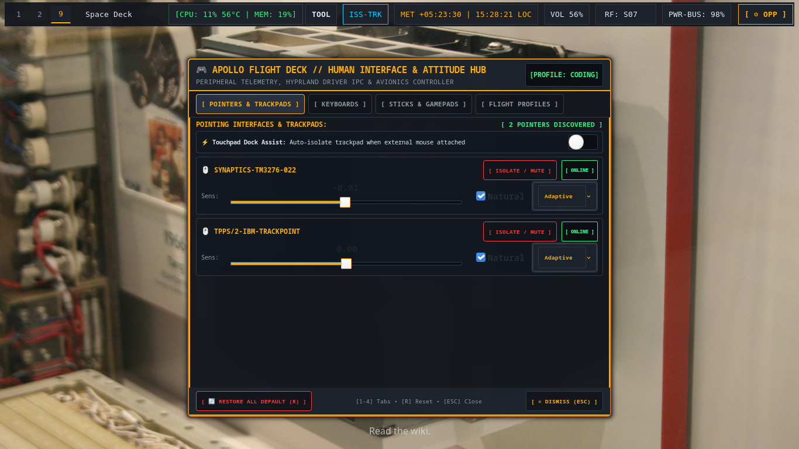
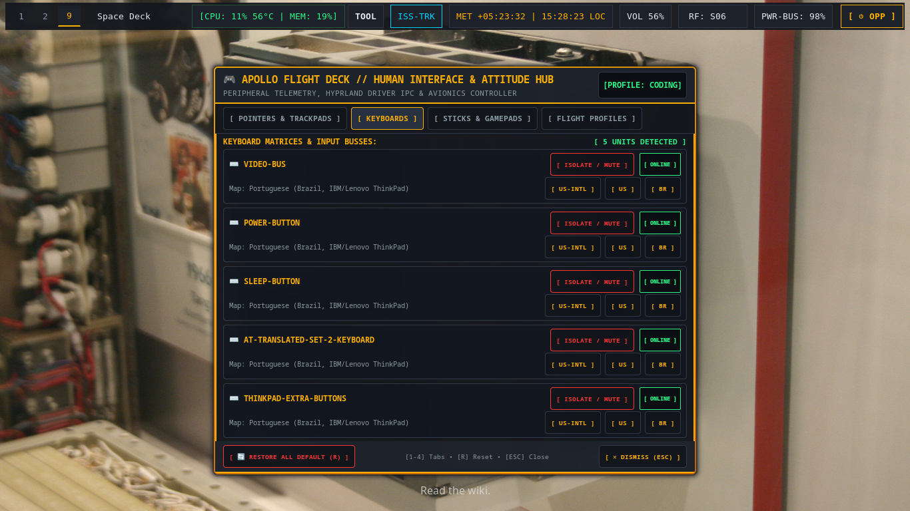
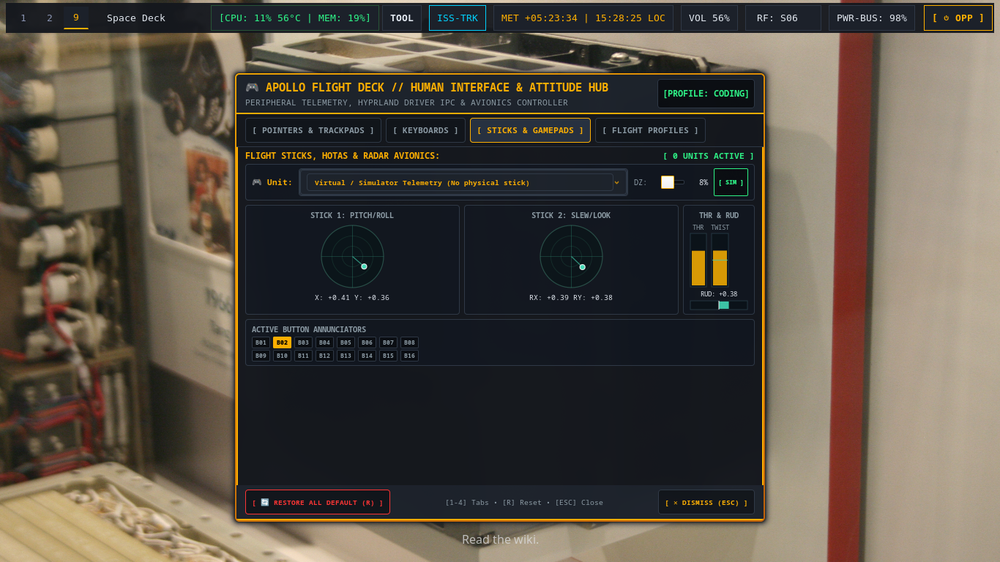
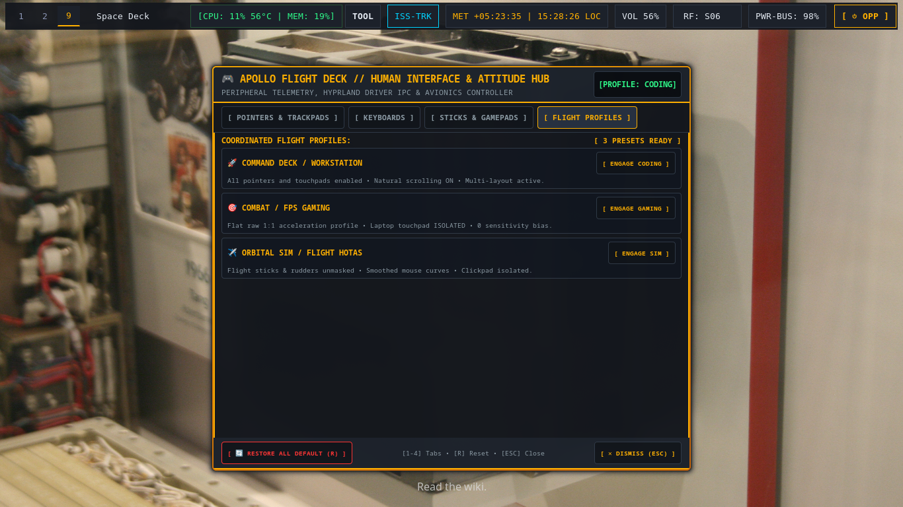

# 🎮 Space Deck — Universal Human Interface & Input Controller

> Centralized telemetry HUD and hardware control avionics (`space-deck` / `space-deck-dialog`) for dynamically discovering, configuring, tweaking, calibrating, and isolating connected Human Interface Devices (Mice, Keyboards, Touchpads, Joysticks, HOTAS, and Gamepads).

---

## 📸 Visual Showcase

### Pointers & Touchpad Controls

### Keyboards & Layout Routing

### Sticks, Gamepads & Multi-Axis Radar Avionics

### Coordinated Flight Profiles

---

## 🕹️ Multi-Controller & Multi-Axis Architecture

When multiple controllers (or complex multi-analog flight gear such as HOTAS throttles, rudder pedals, dual thumbsticks, or flight quadrants) are connected:

1. **🎮 Multi-Device Detection & Selector**:
   - All connected devices in `/dev/input/js*` are discovered with their exact hardware name, total analog axes count, and physical button count.
   - The **Active Flight Unit** dropdown allows instant switching between plugged units (e.g. Flight Stick vs Throttle Quadrant vs Gamepad).
2. **🎯 Dual-Scope 2D Radar Avionics**:
   - **Stick 1 (X/Y)**: Primary Pitch and Roll deflection scope.
   - **Stick 2 (RX/RY)**: Secondary Gimbal Slew, Look, or POV Hat deflection scope.
3. **📊 Throttle & Aux Bargraphs**:
   - **Vertical Throttle Bar (Z)**: `0% .. 100%` absolute thrust level indicator.
   - **Vertical Twist Bar (RZ)**: Stick Z-twist yaw indicator.
   - **Horizontal Rudder / Pedals Bar**: Bipolar center-balanced indicator.
4. **💡 Annunciator Button & Rocker Matrix**:
   - Real-time LED status grid (`B01` .. `B16`) illuminating dynamically upon physical button depress.
5. **🎚️ Deadzone Calibration**:
   - Real-time hardware filter slider (`0%` to `30%`) to eliminate analog stick drift.
