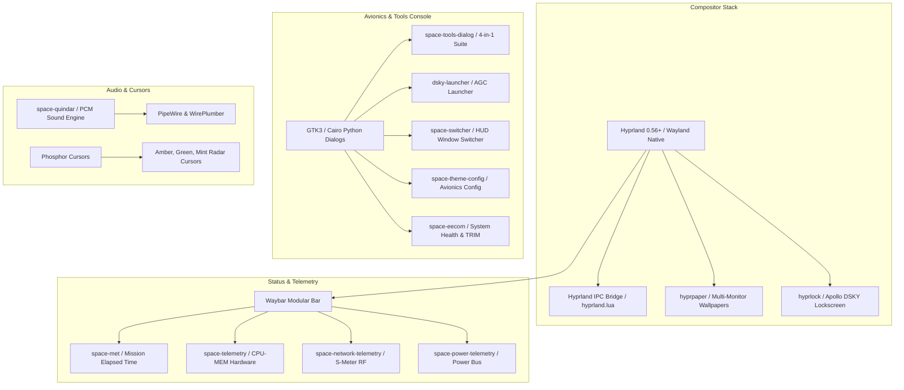

# 🎨 01. System Architecture & Theme Design Standard

The **Space Race Theme** is an authentic, retro-futuristic Linux Wayland desktop environment inspired by the historic 1960s Space Race, mid-century mainframe computing, and early manned spaceflight programs.

---

## 🏛️ 1. Core Architecture & Stack



---

## 🌌 2. The Four Mission Profiles

The theme system provides 4 discrete, authentic mission profiles that synchronize color tokens, window decorations, GTK widgets, cursors, Fastfetch ASCII art, and terminal color schemes.

| Mission Profile | Inspiration & Era | Palette Tokens | Accent Hue | Rounding & Borders |
| :--- | :--- | :--- | :--- | :--- |
| **🚀 NASA** | Apollo Houston MOCR (1969) | `bg: #14171d`, `bg_card: #1c222b`, `text: #ffb000`, `green: #2ef788` | Amber Gold (`#ffb000`) | `4px` rounding, 2px amber bezel border |
| **💾 CRT-Amber** | IBM System/360 Model 91 (1964) | `bg: #0e1014`, `bg_card: #161920`, `text: #ff9e00`, `glow: #e68e00` | Phosphor Amber (`#ff9e00`) | `0px` razor-sharp CRT edge, glow border |
| **📟 CRT-Green** | DEC VT100 / MIT AGC (1966) | `bg: #0a100a`, `bg_card: #0f1c0f`, `text: #33ff33`, `glow: #28cc28` | Phosphor Green (`#33ff33`) | `0px` razor-sharp CRT edge, matrix glow |
| **🛰️ Kosmos-VFD** | Soviet Space Program / OKB-1 (1961) | `bg: #0e1e1a`, `bg_card: #152d27`, `text: #48e5c2`, `red: #ff4860` | Mint Cyan VFD (`#48e5c2`) | `3px` industrial rounding, cyan border |

---

## 🛡️ 3. Strict Zero-White-Background Mandate

To maintain total immersive flight deck realism and prevent blinding flashes during night missions or dark room operations:

1. **Mandatory Overrides**: Every GTK3/GTK4 window, panel, card, button, scrollbar, viewport, and text box explicitly overrides Adwaita light defaults.
2. **Explicit CSS Properties**:
   ```css
   * {
       font-family: 'JetBrainsMono Nerd Font', monospace;
   }
   button, button *, viewport, scrolledwindow, scrollbar {
       background-image: none !important;
       background-color: #10141a !important;
       box-shadow: none !important;
   }
   ```
3. **Contrast Verification**: All label typography meets minimum WCAG AA contrast standards against dark matte backplanes.

---

## 🔊 4. Discrete 44.1 kHz PCM Sound Engine (`space-quindar`)

Authentic telemetry sound effects recorded and generated for mission flight events:

- **Screenshot Capture**: Mechanical camera focal-plane shutter click paired with a 3.2 kHz confirmation tone.
- **Theme Cycling**: High-voltage mainframe solenoid relay click.
- **Critical Battery Alert (<15%)**: Authentic Apollo `1202 PROGRAM ALARM` tone sequence.
- **Session Lock / Unlock**: Radar frequency sweep tones.

---

## 🖱️ 5. Retro Phosphor Wayland Cursors

Custom X11 and Wayland cursor suites built specifically for the theme:
- `Space-Retro-Amber`: 590nm phosphor amber radar reticles and pointer.
- `Space-Retro-Green`: 525nm P1 green phosphor precision crosshairs.
- `Space-Retro-Mint`: VFD mint cyan aerospace tracking cursors.

---

## 🚀 6. Window Kinematics & Physics

Configured in `~/.config/hypr/hyprland.lua` and `hyprland.conf`:
- **Workspace Transitions**: Horizontal sliding (`slide`) tuned with `easeOutQuint` deceleration curves (`speed = 3.5`).
- **Gaps & Opacity**: `gaps_in = 4`, `gaps_out = 8`, active window opacity `1.0`, inactive window opacity `0.92`.
- **Blur & Glassmorphism**: 3-pass dual Kawase blur with `size = 6` and `passes = 3`.
