# 🛠️ 02. Flight Instruments, Dialogs & Tools Manual

The **Space Race Theme** provides an extensive, authentic suite of native Python GTK3/Cairo avionics instruments, telemetry daemons, and system dialogs designed with strict zero-white-background chassis adherence.

---

## 🎛️ 1. Apollo Operations & Tools Console (`space-tools-dialog`)

**Hotkeys**: `SUPER + SHIFT + P` / Waybar Tools button / `space-tools-dialog`

The Tools Console is a 4-in-1 tabbed avionics workstation unifying capture, system maintenance, recovery, and display topology.

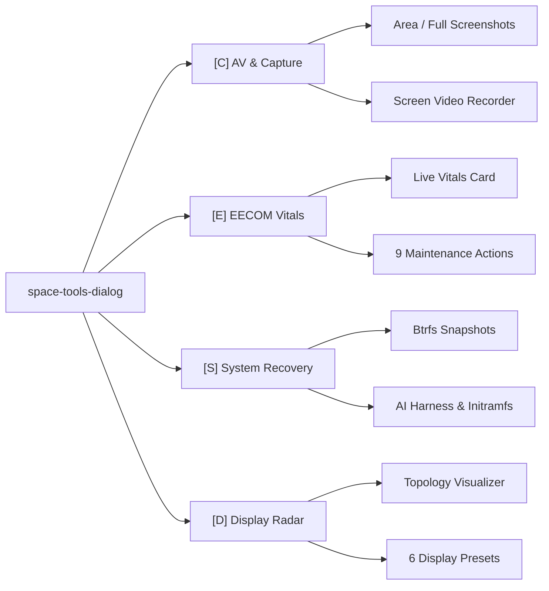
```mermaid
graph LR
    A[space-tools-dialog] --> B["[C] AV & Capture"]
    A --> C["[E] EECOM Vitals"]
    A --> D["[S] System Recovery"]
    A --> E["[D] Display Radar"]

    B --> B1[Area / Full Screenshots]
    B --> B2[Screen Video Recorder]
    C --> C1[Live Vitals Card]
    C --> C2[9 Maintenance Actions]
    D --> D1[Btrfs Snapshots]
    D --> D2[AI Harness & Initramfs]
    E --> E1[Topology Visualizer]
    E --> E2[6 Display Presets]
```

### Tab 1: 📸 [C] AV & Mission Capture

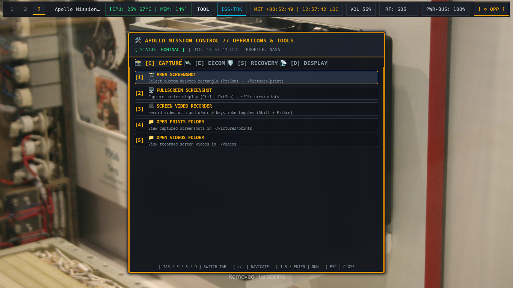

- `[1]` **Area Screenshot**: Interactive box selection (`space-capture area`) with shutter audio and auto-save to `~/Pictures/prints`.
- `[2]` **Fullscreen Screenshot**: Instant display capture (`space-capture full`).
- `[3]` **Screen Video Recorder**: Opens embedded recording options menu (`space-tools-dialog rec`).
- `[4]` **Open Prints Directory**: View captured screenshots in `~/Pictures/prints`.
- `[5]` **Open Videos Directory**: View recorded screen videos in `~/Videos`.

#### 🎥 Video Recording Configuration Sub-View

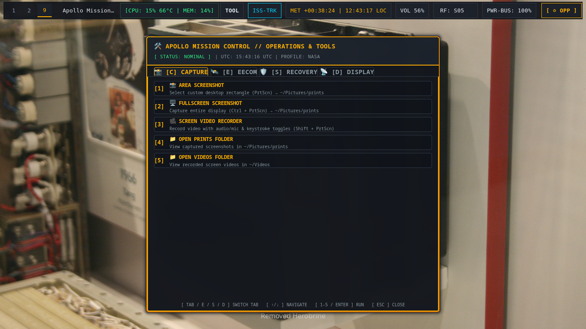

- **Capture Region**: Toggle between `Region Selection (slurp)` and `Full Screen Display`.
- **Audio Routing**: Toggle desktop system sounds and microphone intercom audio independently.
- **Keystroke Overlay**: Security-conscious opt-in keystroke visualization.

---

### Tab 2: 🛰️ [E] EECOM Subsystems & Vitals

- **Live Telemetry & Health Vitals Card**: Real-time health score calculation (`100/100 [NOMINAL]`), AI Director engine status, TRIM timer state, failed systemd units, orphan packages count, pending `.pacnew` configs, root storage, and journal usage.
- **Interactive Action Matrix**:
  - `[1]` **🩺 Run Full Health Diagnostic**: `space-eecom --scan` in terminal console.
  - `[2]` **🔧 Guided Auto-Remediation Sequence**: `space-eecom --fix` (guided safe maintenance with item previews & confirmation before every step).
  - `[3]` **⚡ SSD / NVMe TRIM Discard Routine**: `space-eecom --trim`.
  - `[4]` **📦 Inspect & Purge Orphaned Packages**: `space-eecom --orphans`.
  - `[5]` **📝 Reconcile Pending .pacnew Configs**: `space-eecom --pacnew`.
  - `[6]` **🧹 Optimize Pacman Cache & Prune Old**: `space-eecom --clean-cache`.
  - `[7]` **📜 Audit & Vacuum Oversized Logs**: `space-eecom --vacuum-logs`.
  - `[8]` **🤖 Consult Apollo AI Flight Director**: `space-eecom --ai`.
  - `[9]` **📋 Export Health Audit to Sys-Mem**: `space-eecom --audit`.

---

### Tab 3: 🛡️ [S] System Recovery & Snapshots

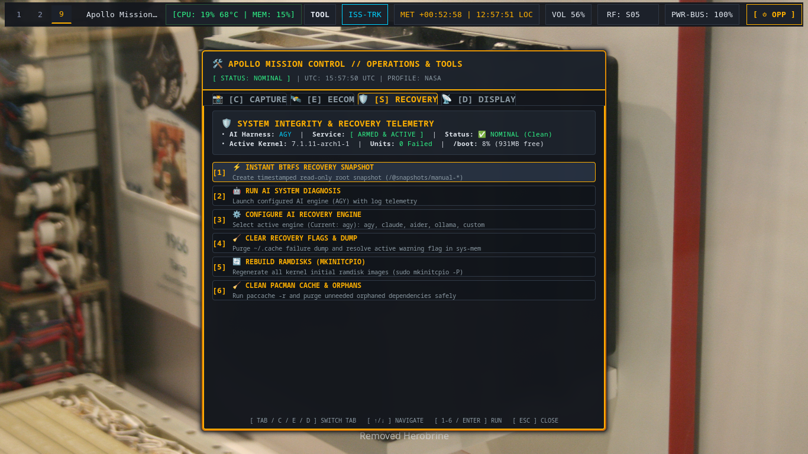

- `[1]` **Btrfs Root Snapshot**: Creates timestamped read-only root snapshot (`/@snapshots/manual-*`).
- `[2]` **AI Recovery Diagnostics**: Dispatches `space-ai-recovery` harness.
- `[3]` **Configure AI Engine**: Select engine (`agy`, `claude`, `aider`, `ollama`, `custom`).
- `[4]` **Rebuild Ramdisks**: Runs `sudo mkinitcpio -P` for all kernels.
- `[5]` **Clean Package Stack**: Runs `paccache -r` and orphan purge.

---

### Tab 4: 📡 [D] Multi-Monitor Display Radar

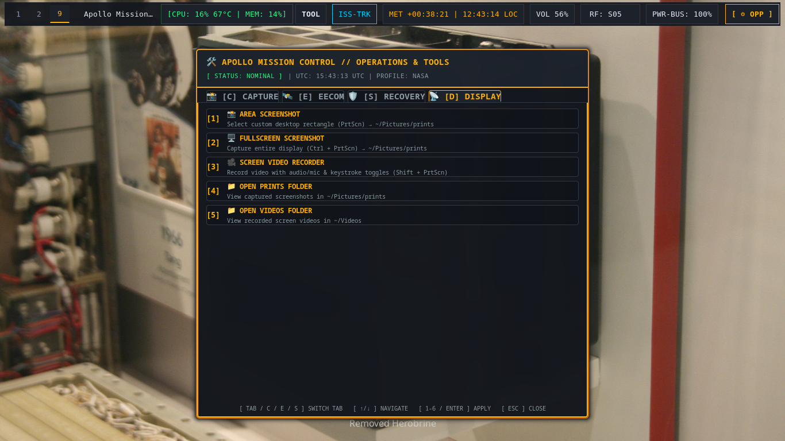

- **Live Topology Radar**: Displays detected monitors, resolutions, refresh rates, positions, and active workspaces.
- **1-Click Topology Presets**:
  - `[1]` Extend Right (Workstation default)
  - `[2]` Extend Left
  - `[3]` Mirror / Presentation Mode
  - `[4]` Primary Only (Battery saver)
  - `[5]` Docked Desktop (Clamshell mode)
  - `[6]` Auto-Detect & Reset

---

## 🎨 2. Visual Avionics & Theme Configurator (`space-theme-config`)

**Hotkeys**: `SUPER + ALT + T` / `space-theme-config`

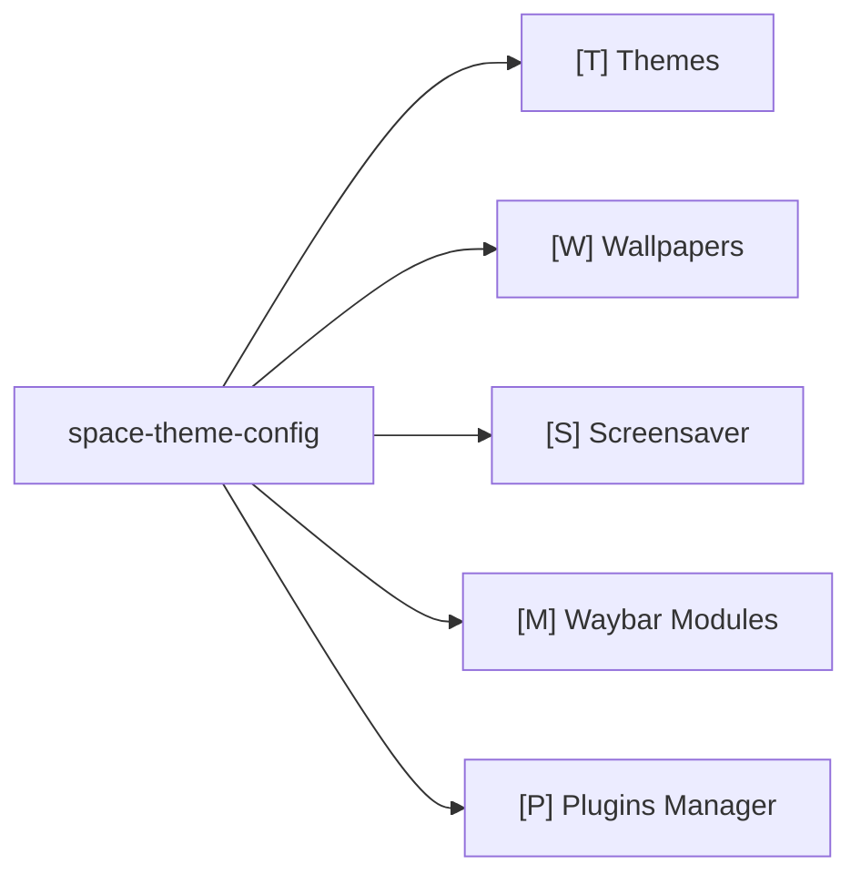
```mermaid
graph LR
    A[space-theme-config] --> B["[T] Themes"]
    A --> C["[W] Wallpapers"]
    A --> D["[S] Screensaver"]
    A --> E["[M] Waybar Modules"]
    A --> F["[P] Plugins Manager"]
```

### 1. Themes Selector Tab (`[T]`)

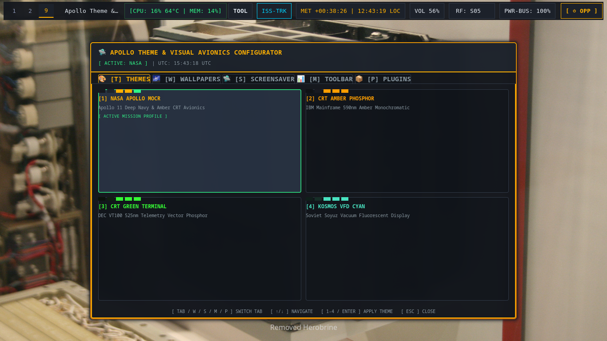

Live visual switching across NASA, CRT-Amber, CRT-Green, and Kosmos-VFD profiles.

### 2. Wallpaper Gallery Tab (`[W]`)

Browse and apply authentic historical archival scans and photographs matching the active profile.

### 3. Screensaver Settings Tab (`[S]`)

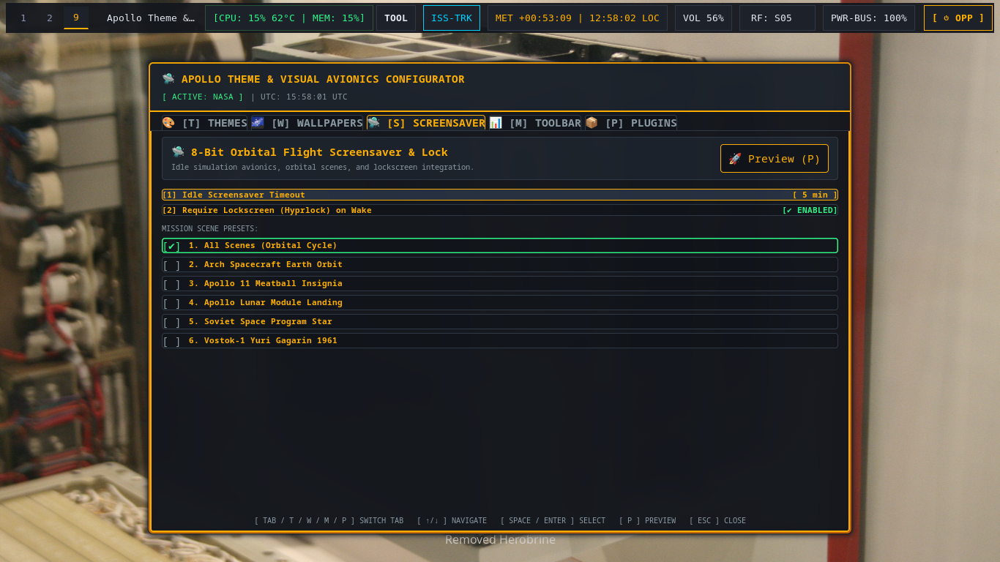

Configure idle timeouts (1m to 30m), scene modes, and Lock-on-Wake security enforcement.

### 4. Waybar Modules Tab (`[M]`)

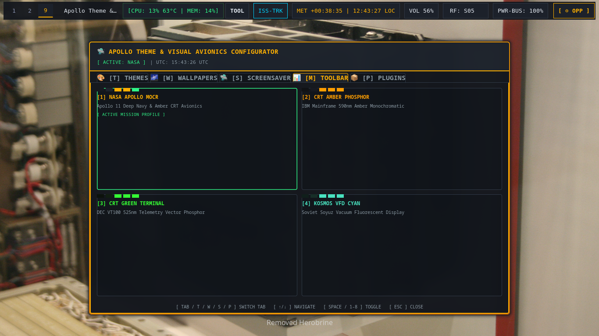

Toggle individual Waybar pills (MET, CPU/MEM, Power Bus, S-Band Wi-Fi, CAPCOM Audio).

### 5. Plugins Manager Tab (`[P]`)

Install, enable, disable, and update standalone plugins (`eecom`, `space-update`, `iss-tracker`, etc.).

---

## 🎛️ 3. Apollo AGC DSKY Application Launcher (`dsky-launcher`)

**Hotkeys**: `SUPER + Space` / `SUPER + R` / `dsky-launcher`

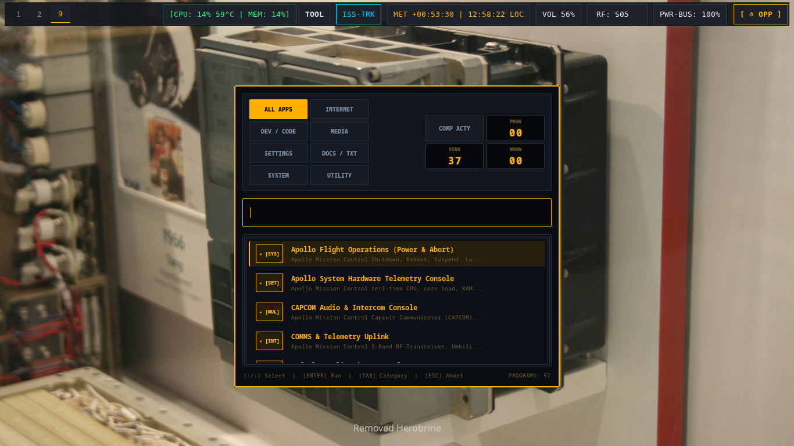

- Authentic MIT Apollo Guidance Computer interface with 8 mission filter groups (`Internet`, `Code`, `Terminal`, `Media`, `Graphics`, `System`, `Science`, `All`).
- Real-time search filter and instant execution on `Enter`.

---

## 🪟 4. Apollo HUD Mission Window Switcher (`space-switcher`)

**Hotkeys**: `ALT + TAB` / `SUPER + TAB` / `space-switcher`

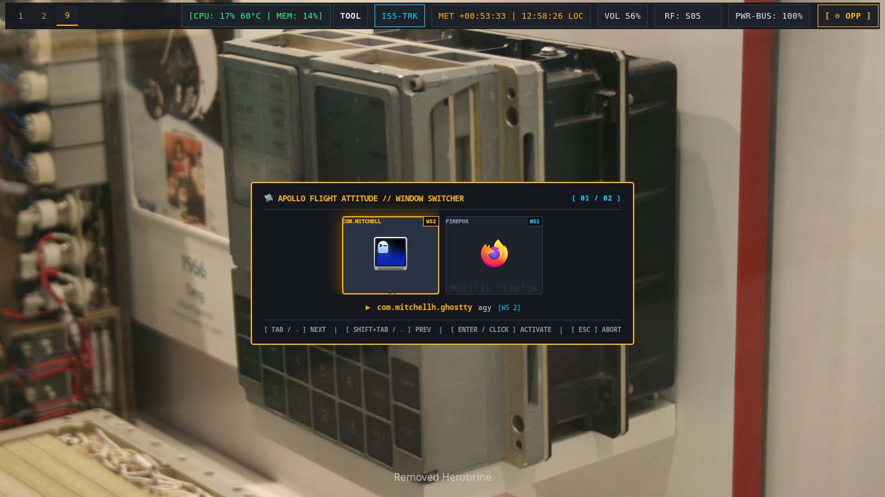

Wayland Alt-Tab window switcher modal with live workspace badges, icons, and titles.

---

## 📡 5. Communications & S-Band Wi-Fi Radar (`space-network-dialog`)

**Hotkeys**: `SUPER + SHIFT + N` / Click Waybar Wi-Fi module

### 1. S-Meter Analog Receiver & Wi-Fi Station Scanner

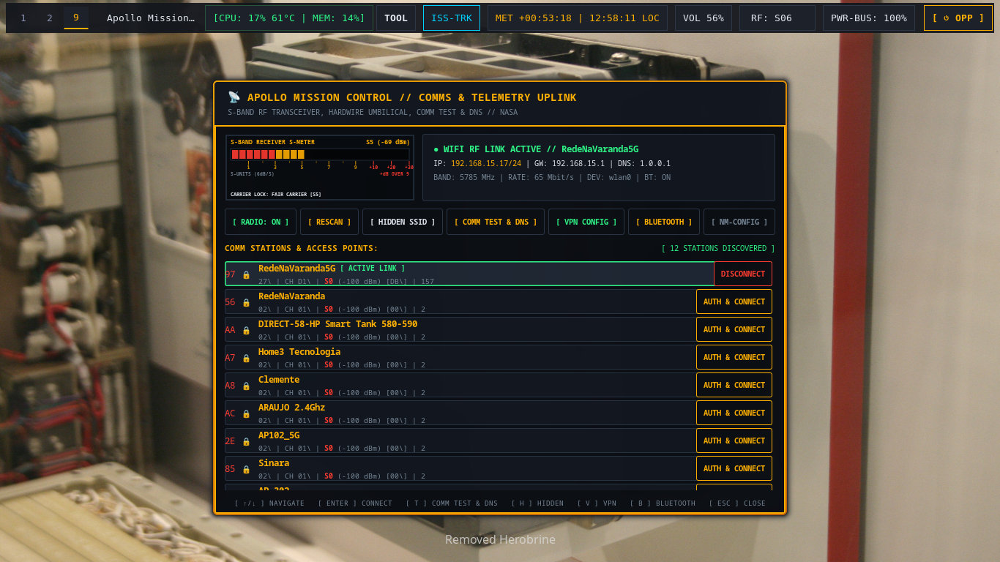

- **Analog S-Meter Dial**: Cairo-rendered RF signal gauge calibrated in discrete S-Units (`S1`-`S9+30dB`).
- **Station Scanner**: Discovered Wi-Fi networks with signal rating and encryption badges.

### 2. RF Propagation Comm Diagnostics & Ground DNS Relays

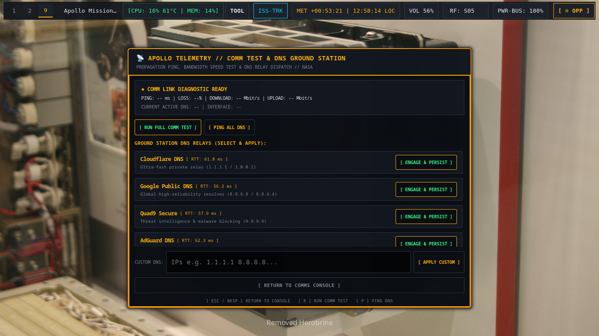

- **Speed & Latency Telemetry**: Round-trip propagation ping latency, packet loss, download speed, and upload throughput.
- **Persistent DNS Selector**: One-click DNS engagement (Cloudflare, Quad9, Google, AdGuard, DHCP) across all network profiles.

### 3. Encrypted VPN Tunnel Dispatch & Bluetooth Manager

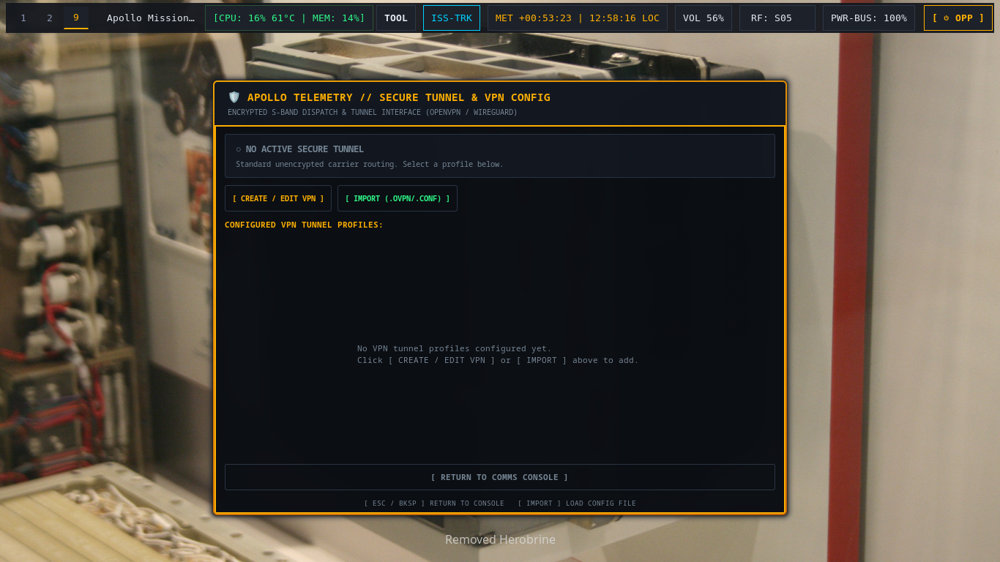

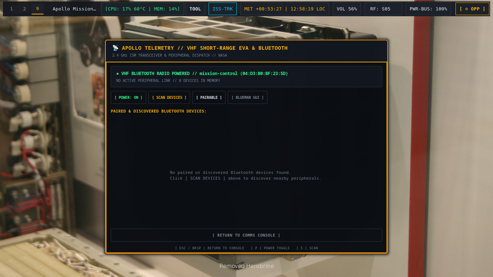

- **VPN Hub**: OpenVPN and WireGuard encrypted connection dispatch and configuration editor.
- **Bluetooth Avionics**: Nearby device discovery, pair, trust, and connection toggles.

---

## ⚡ 6. MDC-02 Main Power Bus & Energy Telemetry (`space-energy-dialog`)

**Hotkeys**: `SUPER + SHIFT + E` / Click Waybar Battery module

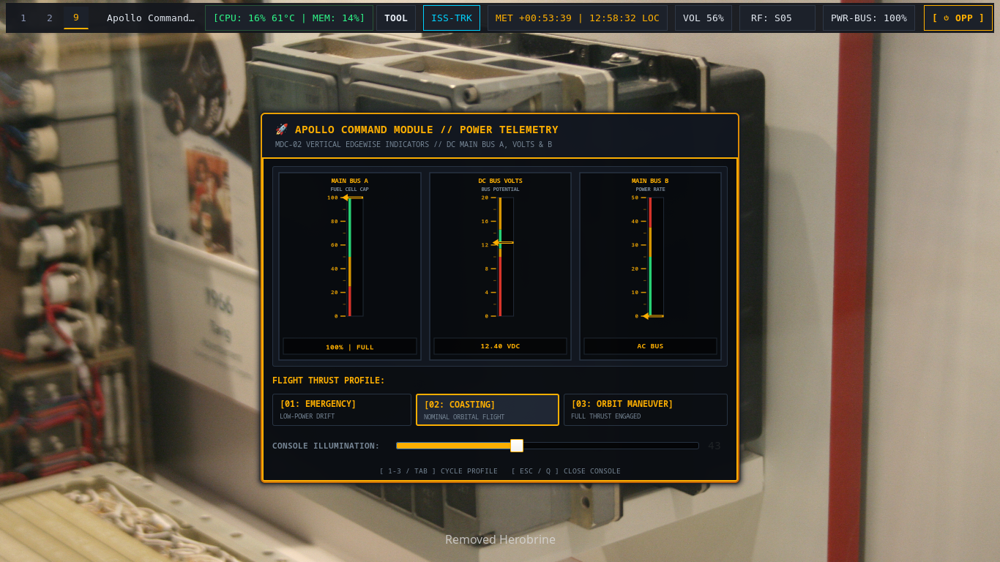

- **Apollo Edgewise Needle Meters**: `DC MAIN BUS A` (Capacity %), `DC BUS VOLTS` (VDC Potential), and `DC MAIN BUS B` (Discharge Watts).
- **Flight Power Modes**: Emergency (Power Save), Coasting (Balanced), Orbit Maneuver (Performance).
- **Console Brightness**: Hardware backlight adjustment slider.

---

## 📊 7. Hardware Telemetry & Task Abort Console (`space-telemetry-dialog`)

**Hotkeys**: `SUPER + SHIFT + C` / Click Waybar Telemetry module

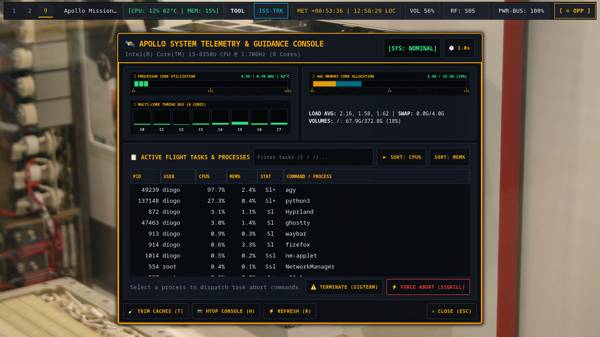

- Segmented LED CPU utilization meter and per-core thread indicators.
- AGC memory allocation meter and filesystem data recorders.
- Interactive process task monitor with instant filtering and SIGTERM/SIGKILL abort confirmation.

---

## 🎙️ 8. CAPCOM Audio & Radio Intercom (`space-capcom-dialog`)

**Hotkeys**: `SUPER + SHIFT + V` / Click Waybar Audio module

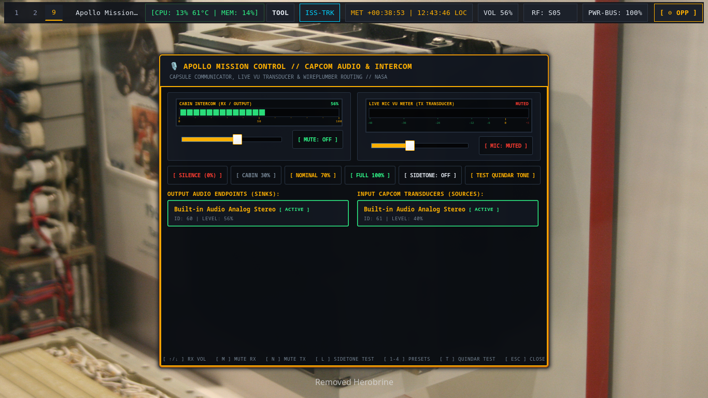

- Dual real-time VU audio meters with peak hold bars.
- WirePlumber default input/output sink selectors and Quindar audio test tones.

---

## 🛰️ 9. ISS Real-Time Orbital Tracker & 7-Day Space Launch Manifest (`space-iss-dialog`)

**Hotkeys**: Waybar ISS pill / `space-iss-dialog`

### 1. ISS Orbital Telemetry & 19-Node Ground Track

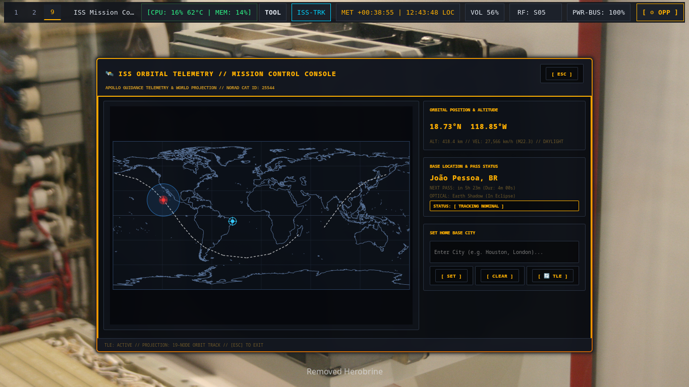

- **High-Precision World Map**: 2:1 Equirectangular Cairo vector projection with landmass coastlines and latitude/longitude coordinate grid.
- **Real-Time SGP4 Tracking**: 19-node ground track projection, live ISS position marker, and 2,200 km visibility footprint circle.
- **Home Base & Optical Passes**: Configurable ground station city (`João Pessoa, BR`, `Houston`, `London`), 24-hour pass prediction with countdown timers, optical sighting flare calculations (Eclipsed / Sunlit), and visual `[ ISS ACQUIRED IN FOOTPRINT ]` alerts.

### 2. 🚀 7-Day Space Launch Manifest & Mission Radar

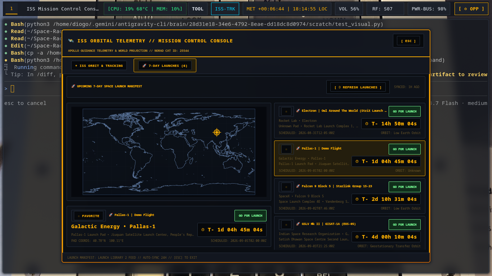

- **Upcoming Mission Manifest**: Real-time launch data parsed from Launch Library 2 with automatic 24-hour background synchronization.
- **Interactive Pad Targeting**: Clicking any mission targets its launch complex on the world map, plotting coordinates with an amber pulsing target crosshair ring (e.g. SLC-4E at Vandenberg, Mahia Peninsula, Jiuquan SLC).
- **Mission HUD Overlay**: Live T-minus countdown ticker (`⏱ T- 00d 00h 00m 00s`), mission provider, vehicle, launch status badges (`GO FOR LAUNCH` / `TBC`), and pad location.
- **Favorite Launches (`★`)**: One-click bookmarking saved persistently to `~/.config/spaceera/favorite-launches.json`.
- **Automated Desktop Notifications**: Background telemetry daemon dispatches alerts at `T-1 Hour`, `T-10 Minutes` (with Quindar sound engine tone), and `T-1 Minute` prior to liftoff.

---

## 🧭 10. Keybinding Flight Directory & Abort Menu

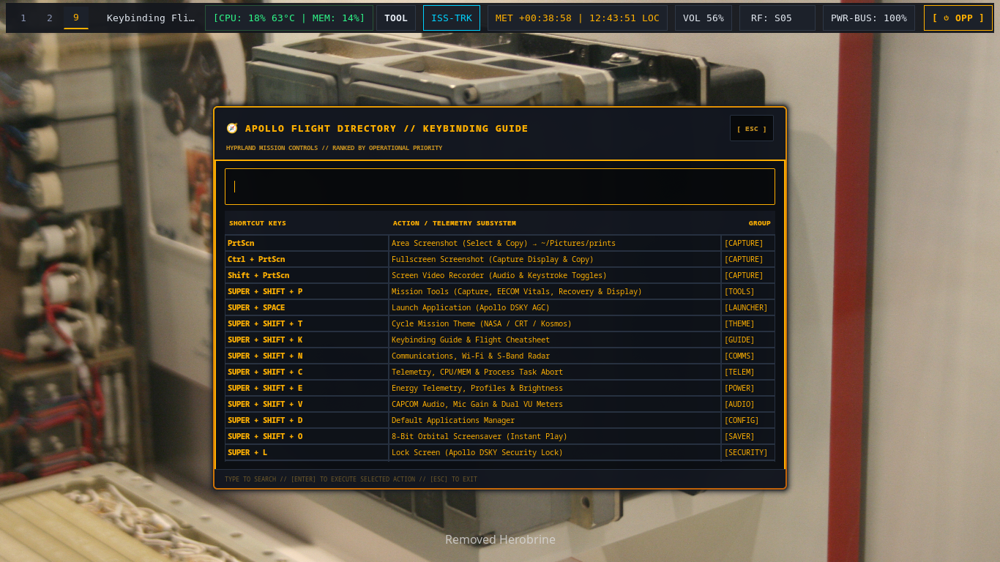

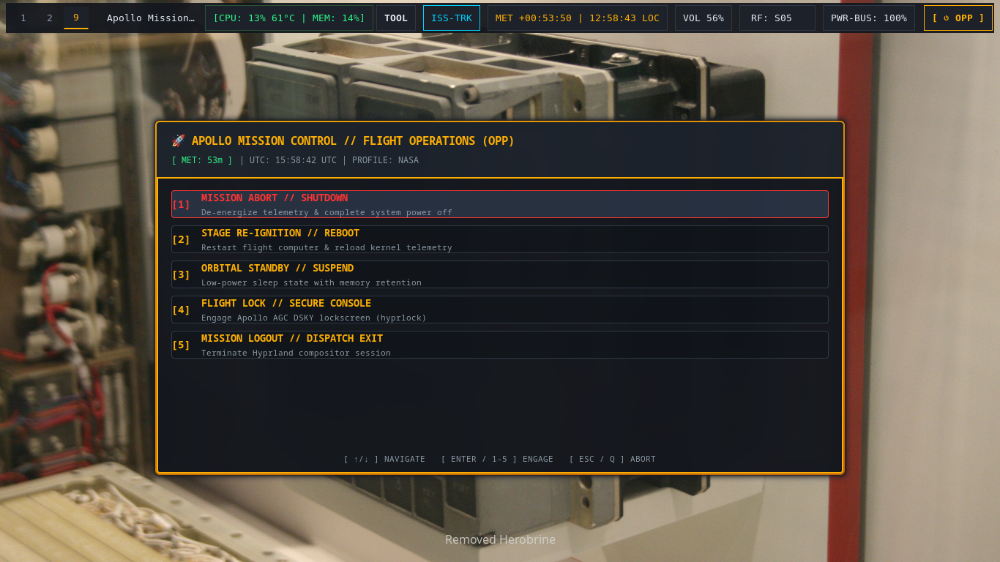

- **Keybinding Directory (`space-keybinds`)**: Searchable flight control cheatsheet (`SUPER + SHIFT + K`).
- **Emergency Flight Abort (`space-power-menu`)**: Clean session logout, reboot, shutdown, lock (`SUPER + SHIFT + M` / `ESC`).

---

## 🎮 11. Space Deck: Universal Human Interface & Input Controller (`space-deck`)

**Hotkeys**: `SUPER + SHIFT + I` / `space-deck`

The **Space Deck** is a centralized hardware telemetry HUD and control console for managing all connected Human Interface Devices (Mice, Keyboards, Touchpads, Joysticks, HOTAS, and Gamepads).

### Pointers & Touchpad Controls (`[1] / [M]`)

- **Live Hardware Discovery**: Auto-detects all pointing hardware via Hyprland IPC (`hyprctl devices -j`).
- **Dynamic Isolation / Mute**: Instantly freeze or re-enable pointers (`[ ONLINE ]` / `[ ISOLATED ]`) with zero compositor lag.
- **Sensitivity & Curves**: Fine-tune sensitivity bias (`-1.0` to `+1.0`) with micro-throttled debouncing, Natural Scroll toggles, and Acceleration Profiles (`Adaptive` vs `Flat`).
- **Touchpad Dock Assist**: Automatically isolates laptop clickpads whenever an external mouse is plugged in.

### Keyboards & Layout Routing (`[2] / [K]`)

- **Active Keymap Telemetry**: Displays current layout and active XKB maps per device.
- **Quick Switchers**: One-click keymap routing (`[ SET BR ]`, `[ SET US ]`, `[ US-INTL ]`).
- **Device Isolation**: Selectively mute secondary or internal keyboards.

### Sticks, Gamepads & Multi-Axis Radar Avionics (`[3] / [J]`)

- **🎮 Multi-Device Detection & Selector**: Discovers all `/dev/input/js*` devices with exact hardware names, axis counts, and button counts, with live switching via the **Active Flight Unit** dropdown.
- **🎯 Dual 2D Radar Scopes**:
  - **Stick 1 (X/Y)**: Primary Pitch and Roll deflection scope.
  - **Stick 2 (RX/RY)**: Secondary Gimbal Slew, Look, or POV Hat deflection scope.
- **📊 Throttle & Aux Bargraphs**: Real-time vertical Throttle (`THR Z`), vertical Stick Twist (`TWIST RZ`), and horizontal Rudder/Pedal indicators.
- **💡 Button & Switch Matrix**: 16 illuminated real-time LED annunciators (`B01` .. `B16`) that light up upon button press.
- **🎚️ Deadzone Calibration**: Hardware drift filter slider (`0%` to `30%`).

### Coordinated Flight Profiles (`[4] / [P]`)

- **`[1] 🚀 COMMAND DECK / WORKSTATION`**: All pointers and gestures enabled, natural scrolling ON, multi-layout active.
- **`[2] 🎯 COMBAT / FPS GAMING`**: Flat raw 1:1 acceleration, laptop touchpad isolated, 0 sensitivity bias.
- **`[3] ✈️ ORBITAL SIM / FLIGHT HOTAS`**: Flight sticks unmasked, smoothed mouse response curves, laptop clickpad isolated.

