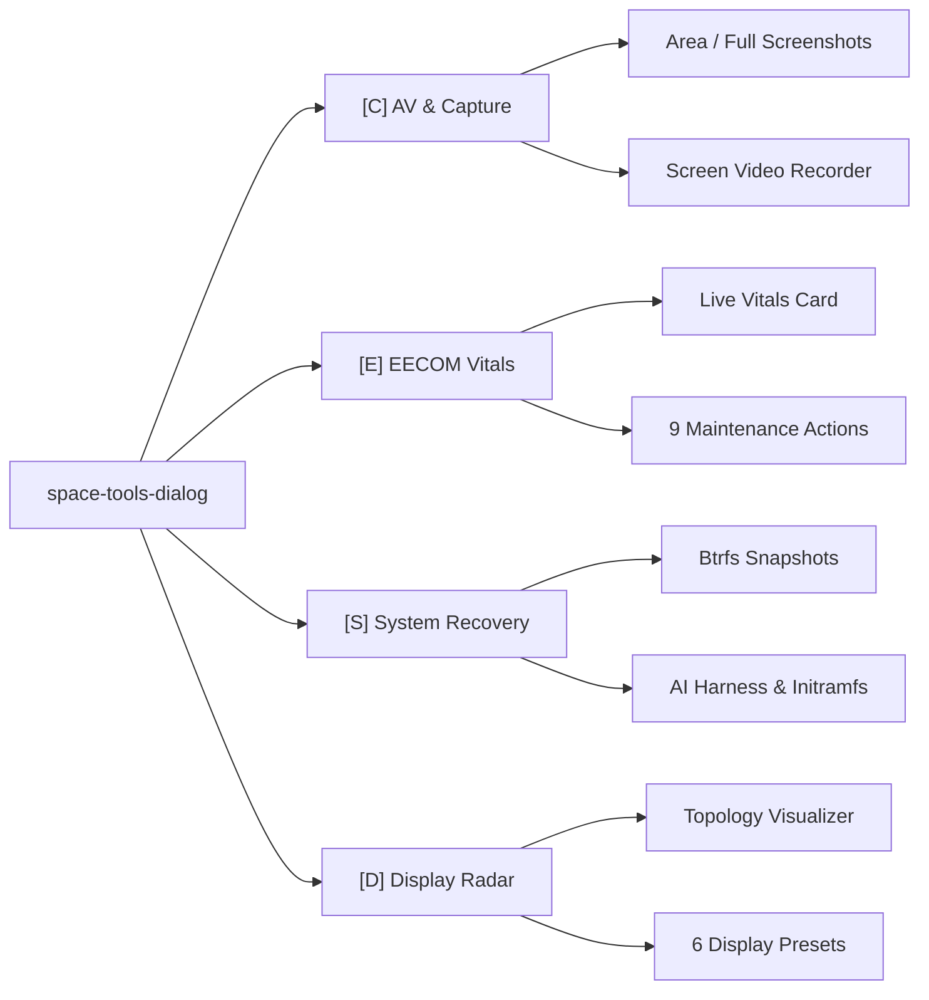
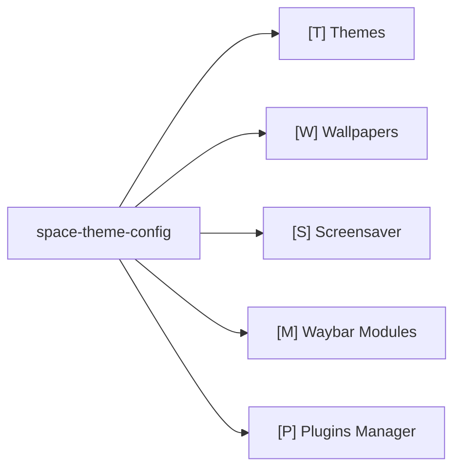

# 🛠️ 02. Flight Instruments, Dialogs & Tools Manual

The **Space Race Theme** provides an extensive, authentic suite of native Python GTK3/Cairo avionics instruments, telemetry daemons, and system dialogs designed with strict zero-white-background chassis adherence.

---

## 🎛️ 1. Apollo Operations & Tools Console (`space-tools-dialog`)

**Hotkeys**: `SUPER + SHIFT + P` / Waybar Tools button / `space-tools-dialog`

The Tools Console is a 4-in-1 tabbed avionics workstation unifying capture, system maintenance, recovery, and display topology.

### Tab 1: 📸 [C] AV & Mission Capture

  

- `[1]` **Area Screenshot**: Interactive box selection (`space-capture area`) with shutter audio and auto-save to `~/Pictures/prints`.
- `[2]` **Fullscreen Screenshot**: Instant display capture (`space-capture full`).
- `[3]` **Screen Video Recorder**: Opens embedded recording options menu (`space-tools-dialog rec`).
- `[4]` **Open Prints Directory**: View captured screenshots in `~/Pictures/prints`.
- `[5]` **Open Videos Directory**: View recorded screen videos in `~/Videos`.

#### 🎥 Video Recording Configuration Sub-View

  

- **Capture Region**: Toggle between `Region Selection (slurp)` and `Full Screen Display`.
- **Audio Routing**: Toggle desktop system sounds and microphone intercom audio independently.
- **Keystroke Overlay**: Security-conscious opt-in keystroke visualization.

---

### Tab 2: 🛰️ [E] EECOM Subsystems & Vitals

  

- **Live Telemetry & Health Vitals Card**: Real-time health score calculation (`100/100 [NOMINAL]`), AI Director engine status, TRIM timer state, failed systemd units, orphan packages count, pending `.pacnew` configs, root storage, and journal usage.
- **Interactive Action Matrix**:
  - `[1]` **🩺 Run Full Health Diagnostic**: `space-eecom --scan` in terminal console.
  - `[2]` **🔧 Guided Auto-Remediation Sequence**: `space-eecom --fix` (guided safe maintenance with item previews & confirmation before every step).
  - `[3]` **⚡ SSD / NVMe TRIM Discard Routine**: `space-eecom --trim`.
  - `[4]` **📦 Inspect & Purge Orphaned Packages**: `space-eecom --orphans`.
  - `[5]` **📝 Reconcile Pending .pacnew Configs**: `space-eecom --pacnew`.
  - `[6]` **🧹 Optimize Pacman Cache & Prune Old**: `space-eecom --clean-cache`.
  - `[7]` **📜 Audit & Vacuum Oversized Logs**: `space-eecom --vacuum-logs`.
  - `[8]` **🤖 Consult Apollo AI Flight Director**: `space-eecom --ai`.
  - `[9]` **📋 Export Health Audit to Sys-Mem**: `space-eecom --audit`.

---

### Tab 3: 🛡️ [S] System Recovery & Snapshots

  

- `[1]` **Btrfs Root Snapshot**: Creates timestamped read-only root snapshot (`/@snapshots/manual-*`).
- `[2]` **AI Recovery Diagnostics**: Dispatches `space-ai-recovery` harness.
- `[3]` **Configure AI Engine**: Select engine (`agy`, `claude`, `aider`, `ollama`, `custom`).
- `[4]` **Rebuild Ramdisks**: Runs `sudo mkinitcpio -P` for all kernels.
- `[5]` **Clean Package Stack**: Runs `paccache -r` and orphan purge.

---

### Tab 4: 📡 [D] Multi-Monitor Display Radar

  

- **Live Topology Radar**: Displays detected monitors, resolutions, refresh rates, positions, and active workspaces.
- **1-Click Topology Presets**:
  - `[1]` Extend Right (Workstation default)
  - `[2]` Extend Left
  - `[3]` Mirror / Presentation Mode
  - `[4]` Primary Only (Battery saver)
  - `[5]` Docked Desktop (Clamshell mode)
  - `[6]` Auto-Detect & Reset

---

## 🎨 2. Visual Avionics & Theme Configurator (`space-theme-config`)

**Hotkeys**: `SUPER + ALT + T` / `space-theme-config`

### 1. Themes Selector Tab (`[T]`)

  

Live visual switching across NASA, CRT-Amber, CRT-Green, and Kosmos-VFD profiles.

### 2. Wallpaper Gallery Tab (`[W]`)

  

Browse and apply authentic historical archival scans and photographs matching the active profile.

### 3. Screensaver Settings Tab (`[S]`)

  

Configure idle timeouts (1m to 30m), scene modes, and Lock-on-Wake security enforcement.

### 4. Waybar Modules Tab (`[M]`)

  

Toggle individual Waybar pills (MET, CPU/MEM, Power Bus, S-Band Wi-Fi, CAPCOM Audio).

### 5. Plugins Manager Tab (`[P]`)

  

Install, enable, disable, and update standalone plugins (`eecom`, `space-update`, `iss-tracker`, etc.).

---

## 🎛️ 3. Apollo AGC DSKY Application Launcher (`dsky-launcher`)

**Hotkeys**: `SUPER + Space` / `SUPER + R` / `dsky-launcher`

  

- Authentic MIT Apollo Guidance Computer interface with 8 mission filter groups (`Internet`, `Code`, `Terminal`, `Media`, `Graphics`, `System`, `Science`, `All`).
- Real-time search filter and instant execution on `Enter`.

---

## 🪟 4. Apollo HUD Mission Window Switcher (`space-switcher`)

**Hotkeys**: `ALT + TAB` / `SUPER + TAB` / `space-switcher`

  

Wayland Alt-Tab window switcher modal with live workspace badges, icons, and titles.

---

## 📡 5. Communications & S-Band Wi-Fi Radar (`space-network-dialog`)

**Hotkeys**: `SUPER + SHIFT + N` / Click Waybar Wi-Fi module

### 1. S-Meter Analog Receiver & Wi-Fi Station Scanner

  

- **Analog S-Meter Dial**: Cairo-rendered RF signal gauge calibrated in discrete S-Units (`S1`-`S9+30dB`).
- **Station Scanner**: Discovered Wi-Fi networks with signal rating and encryption badges.

### 2. RF Propagation Comm Diagnostics & Ground DNS Relays

  

- **Speed & Latency Telemetry**: Round-trip propagation ping latency, packet loss, download speed, and upload throughput.
- **Persistent DNS Selector**: One-click DNS engagement (Cloudflare, Quad9, Google, AdGuard, DHCP) across all network profiles.

### 3. Encrypted VPN Tunnel Dispatch & Bluetooth Manager

  
  

- **VPN Hub**: OpenVPN and WireGuard encrypted connection dispatch and configuration editor.
- **Bluetooth Avionics**: Nearby device discovery, pair, trust, and connection toggles.

---

## ⚡ 6. MDC-02 Main Power Bus & Energy Telemetry (`space-energy-dialog`)

**Hotkeys**: `SUPER + SHIFT + E` / Click Waybar Battery module

  

- **Apollo Edgewise Needle Meters**: `DC MAIN BUS A` (Capacity %), `DC BUS VOLTS` (VDC Potential), and `DC MAIN BUS B` (Discharge Watts).
- **Flight Power Modes**: Emergency (Power Save), Coasting (Balanced), Orbit Maneuver (Performance).
- **Console Brightness**: Hardware backlight adjustment slider.

---

## 📊 7. Hardware Telemetry & Task Abort Console (`space-telemetry-dialog`)

**Hotkeys**: `SUPER + SHIFT + C` / Click Waybar Telemetry module

  

- Segmented LED CPU utilization meter and per-core thread indicators.
- AGC memory allocation meter and filesystem data recorders.
- Interactive process task monitor with instant filtering and SIGTERM/SIGKILL abort confirmation.

---

## 🎙️ 8. CAPCOM Audio & Radio Intercom (`space-capcom-dialog`)

**Hotkeys**: `SUPER + SHIFT + V` / Click Waybar Audio module

  

- Dual real-time VU audio meters with peak hold bars.
- WirePlumber default input/output sink selectors and Quindar audio test tones.

---

## 🛰️ 9. ISS Real-Time Orbital Tracker (`space-iss-dialog`)

**Hotkeys**: Waybar ISS pill / `space-iss-dialog`

  

- Live ISS orbital tracking coordinates, altitude, velocity, and astronaut crew roster.

---

## 🧭 10. Keybinding Flight Directory & Abort Menu

  
  

- **Keybinding Directory (`space-keybinds`)**: Searchable flight control cheatsheet (`SUPER + SHIFT + K`).
- **Emergency Flight Abort (`space-power-menu`)**: Clean session logout, reboot, shutdown, lock (`SUPER + SHIFT + M` / `ESC`).
