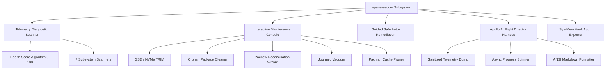

# ⚡ 03. EECOM System Vitals & Automated Remediation

The **Electrical, Environmental, and Consumables Operations Manager (EECOM)** is Apollo Mission Control's core system health, maintenance, and automated remediation suite.

---

## 🎯 1. EECOM Architecture & Safety Standard



### Safety Standard & Rules
1. **Strict User Consent**: Every deletion, uninstallation, or configuration override displays an itemized list of affected items first and requires explicit user confirmation.
2. **Visual Feedback**: Scans feature live visual progress bars, while AI and disk operations feature real-time async spinners with elapsed time counters.
3. **Comprehensive Offline Fallbacks**: If no AI engine is online, EECOM provides a full deterministic offline maintenance menu.

---

## 📊 2. Health Scoring Algorithm (0 - 100)

EECOM computes an overall system stability and health index based on 7 core telemetry checks:

| Subsystem | Health Criterion | Score Deduction on Fault |
| :--- | :--- | :--- |
| **Kernel & Boot** | Active kernel matches `/usr/lib/modules/`, `/boot` has >15% free | `-10` to `-25` pts |
| **Systemd Units** | Zero failed system or user units | `-15` pts per failed unit |
| **Storage & TRIM** | Root disk has >10% free, `fstrim.timer` active | `-10` to `-20` pts |
| **Package Stack** | No stale database locks, orphans audited, cache pruned | `-5` to `-15` pts |
| **Config Integrity** | Zero unresolved `.pacnew` / `.pacsave` configuration files | `-5` pts per file |
| **Memory & ZRAM** | ZRAM active, zero recent critical kernel OOM events | `-10` to `-15` pts |
| **Comms & DNS** | Active DNS resolver online, ping latency nominal | `-5` to `-10` pts |

- **`90 - 100`**: **NOMINAL** (Green) — System operating within ideal parameters.
- **`70 - 89`**: **ADVISORY** (Amber) — Minor pending maintenance (orphans, cache, pacnew).
- **`< 70`**: **CRITICAL** (Red) — Failed services, missing kernel modules, or low disk space.

---

## 🛠️ 3. Command Line Interface (CLI)

```bash
# Run full diagnostic scan with progress bar & scoring
eecom
eecom --scan

# Run interactive guided safe auto-remediation (prompts before each step)
eecom --fix

# Open interactive numbered menu of all non-AI maintenance tasks
eecom --menu
eecom -i

# Dedicated SSD / NVMe TRIM routine
eecom --trim

# Inspect and safely purge orphaned packages
eecom --orphans

# Interactive .pacnew configuration reconciliation wizard
eecom --pacnew

# Prune pacman package cache (retains last 2 versions)
eecom --clean-cache

# Check and vacuum systemd journal logs
eecom --vacuum-logs

# Dispatch Apollo AI Flight Director
eecom --ai

# Export structured Markdown audit to sys-mem vault
eecom --audit

# Machine-readable JSON output for Waybar / daemons
eecom --json
```

---

## 🤖 4. Apollo AI Flight Director & Markdown Formatter

When dispatched via `eecom --ai` or `space-tools-dialog`:
1. **Telemetry Capture**: Collects sanitized telemetry (kernel version, failed units, recent journal errors, dmesg, package transactions, memory pressure).
2. **Async Spinner**: Displays an animated phosphor spinner with elapsed seconds while the AI engine processes the diagnosis.
3. **ANSI Markdown Highlighting**: Renders headings (`🚀`, `🛰️`, `▶`), bold/mint code blocks, warnings, and bullet points directly in the terminal with authentic space mission styling.

---

## 📋 5. Sys-Mem Vault Integration

Running `eecom --audit` automatically generates a timestamped Markdown audit note in `~/sys-mem/sys_mem/system/` linking to the main Obsidian knowledge base index.
