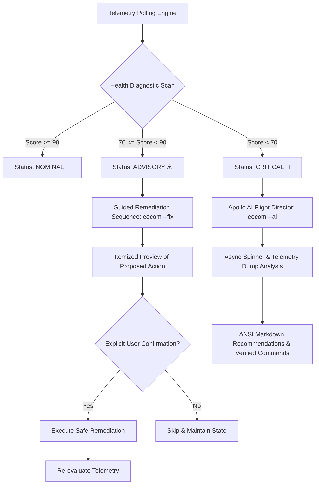
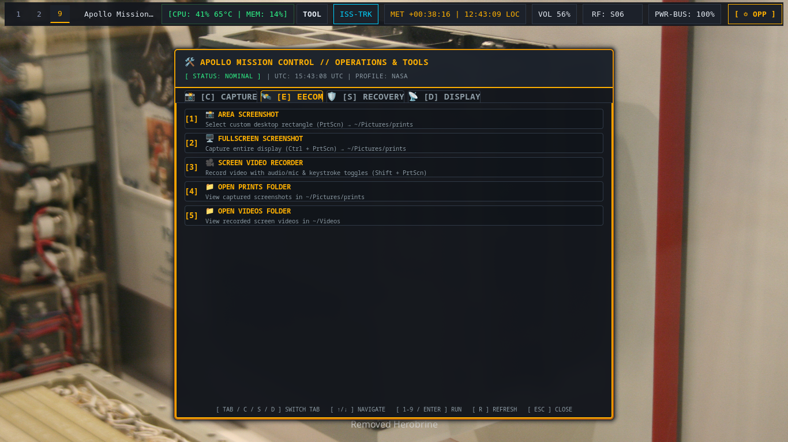
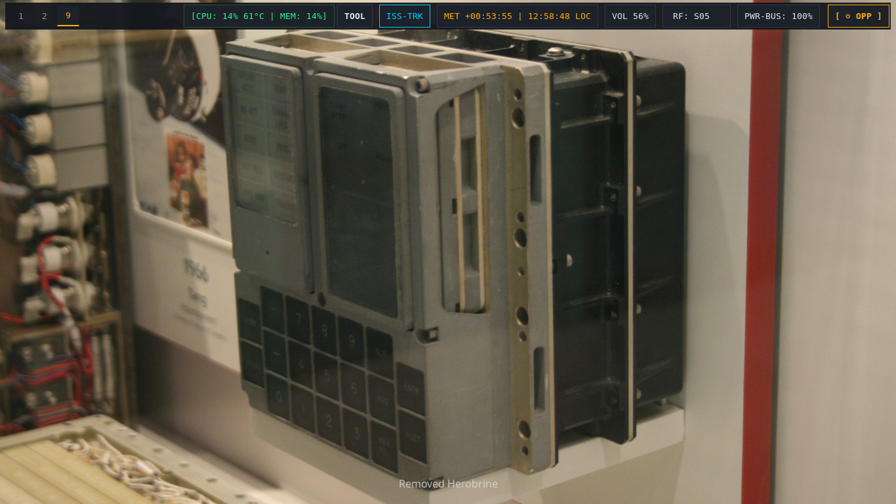
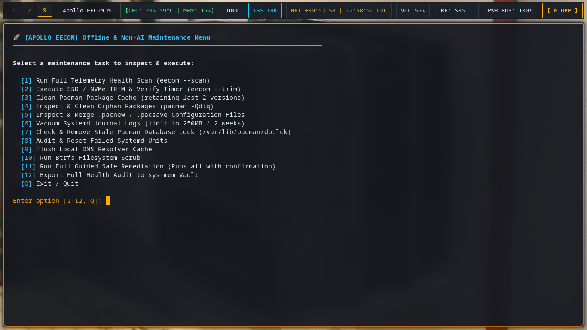

# ⚡ 03. EECOM System Vitals & Automated Remediation

The **Electrical, Environmental, and Consumables Operations Manager (EECOM)** is Apollo Mission Control's core system health, stability, SSD maintenance, and automated remediation suite.

> [!TIP]
> EECOM is also maintained as an independent open-source project and standalone CLI repository at [github.com/diogogc/eecom](https://github.com/diogogc/eecom).

---

## 🎯 1. Operational Flow & Safety Standards



---

## 📸 2. EECOM Visual Telemetry & Interfaces

### 🛰️ GUI Telemetry Console (`space-tools-dialog eecom`)





- **Live Telemetry & Vitals Status Card**: Health score calculation, AI Director engine status, TRIM timer state, failed units, orphan packages, pacnew configs, root disk space, and journal usage.
- **Interactive Action Matrix**: 1-click execution for scans, auto-remediation, TRIM discard, orphan removal, pacnew wizards, cache pruning, and audit note exporting.

---

### 💻 Standalone Terminal Diagnostic Suite (`eecom --scan` / `eecom --menu`)







- **Diagnostic Scan (`eecom --scan`)**: Real-time animated progress bars during subsystem audits, async phosphor spinners during disk-intensive and AI operations, and color-coded health score index (`[✔] NOMINAL`, `[▲] ADVISORY`, `[✖] CRITICAL`).
- **Interactive Maintenance Console (`eecom --menu`)**: Numbered menu for on-demand SSD TRIM, package orphan purging, `.pacnew` reconciliation, cache cleanup, and journal vacuuming.

---

## 📊 3. Health Scoring Algorithm (0 - 100)

EECOM computes an overall system stability and health index based on 7 core telemetry checks:

| Subsystem | Health Criterion | Score Deduction on Fault |
| :--- | :--- | :--- |
| **Kernel & Boot** | Active kernel matches `/usr/lib/modules/`, `/boot` has >15% free | `-10` to `-25` pts |
| **Systemd Units** | Zero failed system or user units | `-15` pts per failed unit |
| **Storage & TRIM** | Root disk has >10% free, `fstrim.timer` active | `-10` to `-20` pts |
| **Package Stack** | No stale database locks, orphans audited, cache pruned | `-5` to `-15` pts |
| **Config Integrity** | Zero unresolved `.pacnew` / `.pacsave` configuration files | `-5` pts per file |
| **Memory & ZRAM** | ZRAM active, zero recent critical kernel OOM events | `-10` to `-15` pts |
| **Comms & DNS** | Active DNS resolver online, ping latency nominal | `-5` to `-10` pts |

---

## 🛠️ 4. Command Line Interface (CLI)

```bash
# Run full diagnostic scan with progress bar & scoring
eecom
eecom --scan

# Run interactive guided safe auto-remediation (prompts before each step)
eecom --fix

# Open interactive numbered menu of all non-AI maintenance tasks
eecom --menu
eecom -i

# Dedicated SSD / NVMe TRIM routine
eecom --trim

# Inspect and safely purge orphaned packages
eecom --orphans

# Interactive .pacnew configuration reconciliation wizard
eecom --pacnew

# Prune pacman package cache (retains last 2 versions)
eecom --clean-cache

# Check and vacuum systemd journal logs
eecom --vacuum-logs

# Dispatch Apollo AI Flight Director
eecom --ai

# Export structured Markdown audit to sys-mem vault
eecom --audit
```
