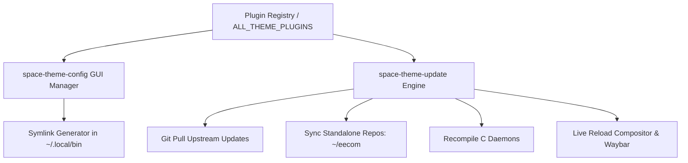

# 🔌 04. Theme Plugin Architecture & Update Engine

The Space Race Theme features a modular **Plugin Architecture** allowing tools, standalone repositories, daemons, and avionics dialogs to be installed, toggled, and updated independently.

---

## 🧩 1. Plugin System Architecture

Plugins are registered in `~/.config/space-theme/plugins.json` and managed through the `space-theme-config` Plugins Tab.

---

## 📦 2. Standard Registered Plugins

| Plugin ID | Name & Description | Source Binary | Exposed Binaries in `~/.local/bin` |
| :--- | :--- | :--- | :--- |
| `eecom` | **Apollo EECOM Health & Remediation Suite** | `bin/space-eecom` | `eecom`, `space-eecom` |
| `space-update` | **Theme & Plugin Synchronizer** | `bin/space-theme-update` | `space-update`, `space-theme-update` |
| `iss-tracker` | **ISS Real-Time Orbital Tracking Suite** | `bin/space-iss-dialog` | `space-iss-dialog`, `space-iss-telemetry` |
| `space-tools` | **Mission Tools & AV Capture Studio** | `bin/space-tools-dialog` | `space-tools-dialog`, `space-cheatsheet` |
| `space-network` | **Communications & S-Band Wi-Fi Radar** | `bin/space-network-dialog`| `space-network-dialog`, `space-network-telemetry` |
| `space-energy` | **MDC-02 Power Bus & Energy Telemetry** | `bin/space-energy-dialog` | `space-energy-dialog`, `space-power-telemetry` |
| `space-capcom` | **CAPCOM Audio Intercom & Dual VU Meters** | `bin/space-capcom-dialog` | `space-capcom-dialog`, `space-vox-dialog` |

---

## ⚙️ 3. Managing Plugins via GUI

1. Open `space-theme-config` (`SUPER + ALT + T` or click the theme pill in Waybar).
2. Switch to the **`[P] PLUGINS`** tab (or press key `P`).
3. View the list of all available plugins with their installed status, description, and binary links.
4. Click any plugin row (or press `1`-`9` / `Enter`) to **Enable / Install** or **Disable / Remove** its binary symlinks from `~/.local/bin`.
5. Press `U` to trigger `space-update` and pull the latest upstream updates for all plugins.

---

## 🚀 4. The `space-theme-update` Engine

Run `space-update` (or `space-theme-update`) from terminal or GUI:
1. Pulls latest Git changes in `~/Space-Race-Theme`.
2. Syncs standalone plugin repositories (such as `~/eecom`).
3. Recompiles C background daemons in `src/` (e.g. `hyprland-ipc-bridge`).
4. Rebuilds and verifies all `~/.local/bin` symlinks.
5. Issues live configuration reload signals (`hyprctl reload`, `killall -SIGUSR2 waybar`).
