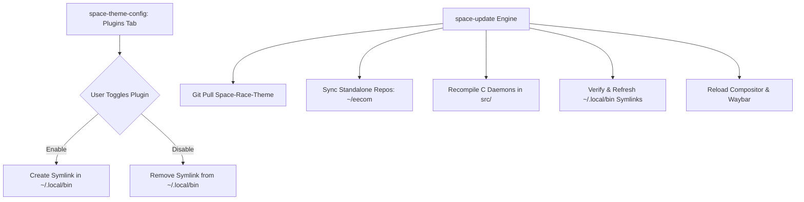
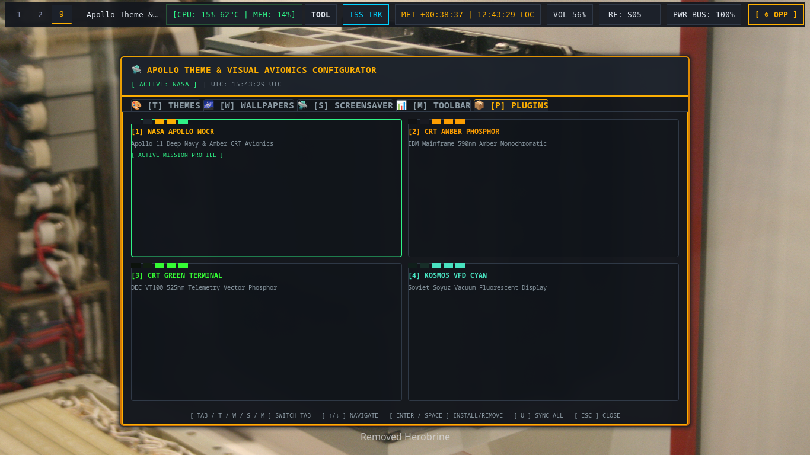

# 🔌 04. Theme Plugin Architecture & Update Engine

The **Space Race Theme** features a modular **Plugin Architecture** allowing tools, standalone repositories, daemons, and avionics dialogs to be installed, toggled, and updated independently.

---

## 🧩 1. Plugin Management Flux

---

## 📸 2. GUI Plugin Manager Interface

1. Open `space-theme-config` (`SUPER + ALT + T`).
2. Switch to the **`[P] PLUGINS`** tab (or press key `P`).
3. Click any row (or press `1`-`9` / `Enter`) to enable or disable the plugin.
4. Press `U` to trigger `space-update` and pull the latest upstream updates for all plugins.

---

## 📦 3. Standard Registered Plugins

| Plugin ID | Name & Description | Source Binary | Exposed Binaries in `~/.local/bin` |
| :--- | :--- | :--- | :--- |
| `eecom` | **Apollo EECOM Health & Remediation Suite** | `bin/space-eecom` | `eecom`, `space-eecom` |
| `space-update` | **Theme & Plugin Synchronizer** | `bin/space-theme-update` | `space-update`, `space-theme-update` |
| `iss-tracker` | **ISS Real-Time Orbital Tracking Suite** | `bin/space-iss-dialog` | `space-iss-dialog`, `space-iss-telemetry` |
| `space-tools` | **Mission Tools & AV Capture Studio** | `bin/space-tools-dialog` | `space-tools-dialog`, `space-cheatsheet` |
| `space-network` | **Communications & S-Band Wi-Fi Radar** | `bin/space-network-dialog`| `space-network-dialog`, `space-network-telemetry` |
| `space-energy` | **MDC-02 Power Bus & Energy Telemetry** | `bin/space-energy-dialog` | `space-energy-dialog`, `space-power-telemetry` |
| `space-capcom` | **CAPCOM Audio Intercom & Dual VU Meters** | `bin/space-capcom-dialog` | `space-capcom-dialog`, `space-vox-dialog` |
