# 🛰️ Apollo Space Race Theme: Comprehensive Wiki

<div align="center">

```
  ____   ____   _      ____  _____  _____       ____   ___    ____  _____ 
 / ___| |  _ \ / \    / ___|| ____|| ____|     |  _ \ / _ \  / ___|| ____|
 \___ \ | |_) / _ \  | |    |  _|  |  _| _____ | |_) / /_\ \| |    |  _|  
  ___) ||  __/ ___ \ | |___ | |___ | |__|_____||  _ <|  _  || |___ | |___ 
 |____/ |_| /_/   \_\ \____||_____||_____|     |_| \_\_| |_| \____||_____|
                     FLIGHT OPERATIONS WIKI & MANUAL
```

**Official Knowledge Base, Avionics Manual, System Architecture & How-To Guide**  
*For Arch Linux, Hyprland, Waybar, and Mission Control Utilities*

</div>

---

## 🧭 Wiki Index & Navigation

Welcome to the **Space Race Theme Wiki**. This comprehensive knowledge base covers the architecture, avionics dialogs, system maintenance suites, plugin ecosystem, and operational runbooks for the entire flight desktop environment.

```mermaid
graph TD
    A[Space Race Theme Wiki] --> B[01. Architecture & Design Standard]
    A --> C[02. Flight Instruments & Tools Manual]
    A --> D[03. EECOM System Vitals & Maintenance]
    A --> E[04. Plugin System & Update Engine]
    A --> F[05. Operational How-To Guides]
    A --> G[06. Troubleshooting & Recovery Runbook]

    B --> B1[Zero-White Policy]
    B --> B2[Color Tokens & 4 Profiles]
    B --> B3[Quindar Sound Engine]

    C --> C1[space-tools-dialog]
    C --> C2[dsky-launcher & space-switcher]
    C --> C3[Network, Power, Capcom, Telemetry]

    D --> D1[Health Scoring Algorithm]
    D --> D2[SSD TRIM & Storage]
    D --> D3[Pacnew & Orphan Cleaners]
    D --> D4[AI Flight Director]

    E --> E1[Plugin Registry]
    E --> E2[space-theme-config Manager]
    E --> E3[space-theme-update Engine]

    F --> F1[Theme & Wallpaper Switching]
    F --> F2[Multi-Monitor Topology]
    F --> F3[Screensaver & Lock Tuning]

    G --> G1[Btrfs Snapshot Recovery]
    G --> G2[Kernel Fallback Watcher]
    G --> G3[Wayland IPC Diagnostics]
```



---

## 📚 Table of Contents

### 🎨 [01. Architecture & Design Standard](01-architecture-and-design.md)
- **Design Philosophy & Historical Context**: Apollo MOCR, DEC VT100/VT220, MIT AGC, and Soviet OKB-1.
- **Unified Color Token Matrix**: Detailed semantic palette breakdown across `nasa`, `crt-amber`, `crt-green`, and `kosmos-vfd`.
- **Strict Zero-White-Background Policy**: Eliminating blinding flashes across GTK3/GTK4, Qt, and Wayland windows.
- **Discrete 44.1 kHz PCM Sound Engine (`space-quindar`)**: Mechanical shutters, Quindar tones, relay clicks, and 1202 program alarms.
- **Phosphor Wayland Cursor Suites**: `Space-Retro-Amber`, `Space-Retro-Green`, `Space-Retro-Mint`.
- **Window Kinematics & Physics**: Smooth horizontal workspace slides, custom cubic bezier curves, and glassmorphism.

### 🛠️ [02. Flight Instruments & Tools Manual](02-flight-instruments-and-tools.md)
- **`space-tools-dialog`**: 4-in-1 Operations Panel (AV Capture, EECOM Vitals, Recovery, Display Radar).
- **`dsky-launcher`**: Apollo AGC Verb/Noun Application Launcher with 8 mission filter groups.
- **`space-switcher`**: Wayland HUD mission window switcher with live workspace chips.
- **`space-theme-config`**: Visual Avionics, Wallpapers, Screensaver, and Plugin Manager.
- **`space-network-dialog`**: S-Meter RF Signal Gauge, Wi-Fi Station Scanner, Persistent DNS, VPNs.
- **`space-telemetry-dialog`**: Segmented LED Core Utilization, Memory Allocation, Task Abort.
- **`space-energy-dialog`**: Apollo Command Module MDC-02 Edgewise Needle Gauges, ACPI Battery, Brightness.
- **`space-capcom-dialog`**: CAPCOM Radio Intercom, Dual VU Meters, WirePlumber Routing.
- **`space-iss-dialog` & `space-iss-telemetry`**: Real-time ISS Ground Track & Orbital Telemetry.
- **`space-screensaver`**: 8-bit retro pixel scaling across 5 spaceflight simulation scenes.
- **`space-power-menu`**: Emergency Flight Abort & Power dispatch.

### ⚡ [03. EECOM System Vitals & Automated Remediation](03-eecom-and-system-maintenance.md)
- **What is EECOM**: Electrical, Environmental and Consumables Operations Manager.
- **Diagnostic Health Scoring Algorithm**: `0 - 100/100` deduction model across kernel, systemd, packages, storage, and logs.
- **Guided Safe Auto-Remediation Sequence (`eecom --fix`)**: Explicit item previews and confirmation before every modification.
- **SSD / NVMe On-Demand Block Discard (`eecom --trim`)**: Hardware TRIM across all mounted partitions.
- **Orphaned Package Inspection & Clean Removal (`eecom --orphans`)**: Safe dependency pruning.
- **Interactive `.pacnew` Configuration Reconciliation Wizard (`eecom --pacnew`)**: Keep, overwrite, diff, and merge tools.
- **Pacman Package Cache Pruning & Journald Log Vacuuming (`eecom --clean-cache`, `eecom --vacuum-logs`)**.
- **Apollo AI Flight Director Dispatch (`eecom --ai`)**: Live spinner feedback & ANSI markdown formatting.
- **Structured Sys-Mem Vault Audit Note Exporter (`eecom --audit`)**: Automated Markdown reporting in `~/sys-mem/`.

### 🔌 [04. Plugin System & Update Engine](04-plugin-system-and-updates.md)
- **Plugin System Architecture**: Discovery, registry schema, and `ALL_THEME_PLUGINS` specification.
- **Managing Plugins via GUI**: Using the `space-theme-config` Plugins Tab.
- **`space-theme-update` Engine**: Syncing repos, building C daemons, updating `~/.local/bin` symlinks.
- **Authoring Custom Plugins**: Step-by-step guide to registering new tools and dialogs.
- **Standalone Repository Synchronization**: Propagating standalone repositories (e.g. `~/eecom`) to the theme.

### 📖 [05. Operational How-To Guides](05-how-to-guides.md)
- **Theme & Wallpaper Switching**: Hotkeys, Waybar clicks, and CLI switches.
- **Multi-Monitor Display Topology**: Fast presets (Extend, Mirror, Clamshell, Solo).
- **8-Bit Screensaver & Security Locks**: Configuring timeout delays, scene selection, and lock-on-wake.
- **Configuring AI Flight Directors**: Setting up `agy`, `ollama`, `claude`, `aider`, or custom commands.
- **Customizing Waybar Modules**: Reordering pills, editing interval rates, and styling badges.
- **Persistent DNS Across Network Profiles**: One-click DNS engagement and DHCP resets.

### 🚨 [06. Troubleshooting & Recovery Runbook](06-troubleshooting-and-recovery.md)
- **Emergency Recovery**: Creating and rolling back Btrfs root snapshots.
- **Autonomous Kernel Crash Watcher**: `kernel-fallback-collector.service` diagnostics.
- **Rebuilding Initial Ramdisks**: `mkinitcpio -P` emergency procedures.
- **Wayland & Hyprland IPC Debugging**: Socket diagnostics, `hyprctl`, and crash logs.
- **PipeWire & WirePlumber Audio Troubleshooting**: Device node routing and VU meter calibration.
- **Pacman Database Locks & Stale Package Maintenance**.

---

<div align="center">
  <sub>Apollo Space Race Theme • Engineered for Arch Linux & Hyprland • Zero-White-Background Standard</sub>
</div>
